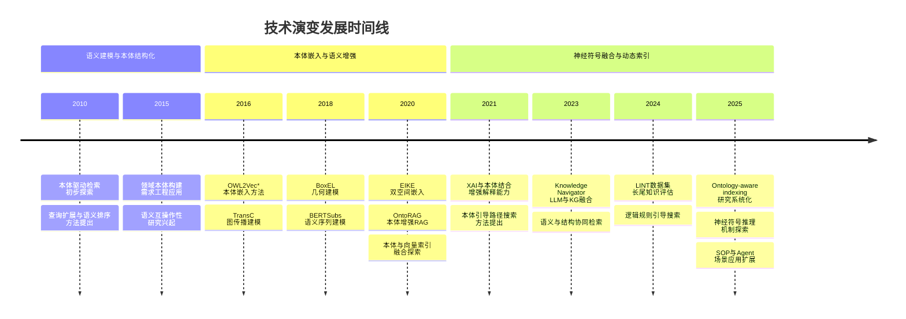
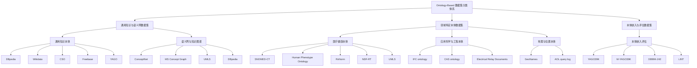
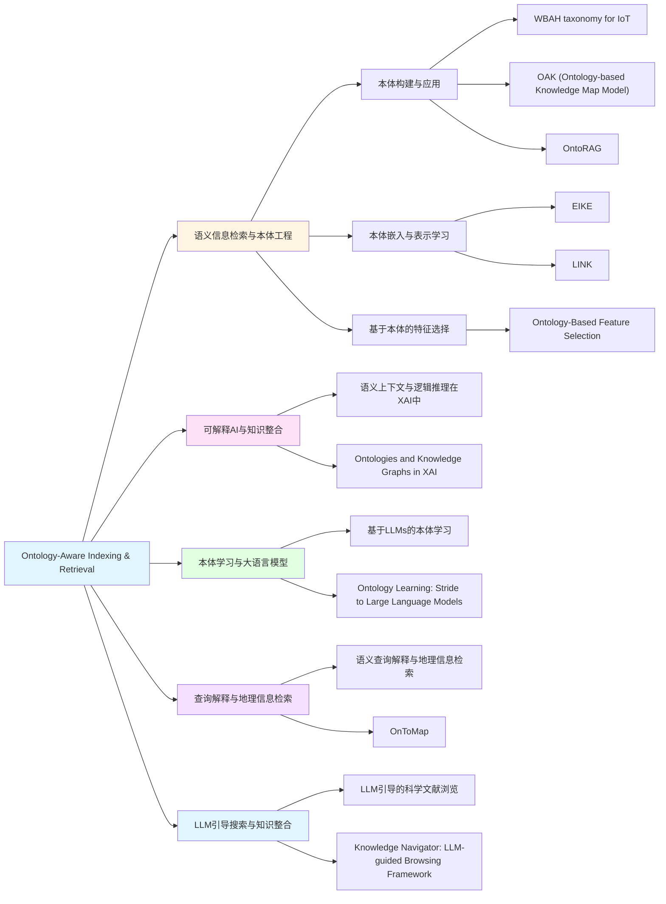

# **基于本体感知的混合索引与神经符号检索方法研究：面向智能客服与业务流程优化的语义增强信息检索**

**摘 要**：本体论感知索引方法作为连接结构化知识与神经语义表示的重要桥梁，近年来在信息检索与智能系统领域受到广泛关注。本文系统综述了该方法的理论演进、数据支持、技术架构与未来挑战。研究指出，从基于规则的逻辑推理到本体嵌入技术，再到神经符号融合方法，本体驱动检索逐步实现从静态结构到动态语义的跃迁，显著提升了语义匹配、逻辑推理与系统可解释性。在数据层面，构建了涵盖通用知识、领域特定与本体嵌入三类数据集的分类体系，为不同应用场景下的方法评估提供了支撑。技术上，提出融合符号推理与神经表示的多模态索引机制，以增强检索系统的结构约束与路径可追溯性。尽管已有进展，但本体自动化构建、语义与向量融合机制、动态知识演化等方面仍面临诸多挑战。未来需推动本体与神经模型的深度集成，发展神经符号推理机制，建立标准化评估体系，以实现更高效、可扩展、可解释的ontology-aware索引系统，进而提升智能客服、政务问答等任务导向场景中的意图理解与服务匹配能力。

**关键词**：本体论感知索引,神经符号融合,语义增强检索,知识嵌入,动态知识演化
# 1.章节标题

从符号本体到神经语义：知识驱动索引方法的范式演进  

章节摘要  
本体论（ontology）作为知识表示的核心框架，其在信息索引与检索中的作用经历了从基于规则的符号推理到融合神经语义的混合范式的转变。早期的本体驱动检索（ontology-based information retrieval）依赖于逻辑推理与结构化查询，受限于知识表达的静态性和推理效率。近年来，随着大规模语言模型与检索增强生成（RAG）技术的发展，ontology-aware indexing 和 ontology-grounded retrieval 成为连接符号知识与神经表示的关键路径。然而，现有方法在利用本体的层级、关系、规则和约束方面仍存在显著不足，特别是在动态本体演化、推理可解释性与任务导向检索的整合方面。本章系统梳理了该方向的技术演进脉络，分析了代表性方法的理论基础与实践局限，为后续探讨本体感知索引的科学问题与创新路径奠定基础。

## 1.1 本体论感知索引与检索的定义和范围

本体论感知索引与检索（ontology-aware indexing and retrieval）旨在通过显式建模本体结构（如概念、关系、规则、层级、约束）来增强信息检索系统的语义理解能力与推理能力。其核心任务是构建一种能够融合本体语义与统计模型（如向量索引、图索引）的索引机制，使得检索过程不仅依赖于关键词匹配或向量相似度，还能基于本体中的逻辑关系、语义约束和推理规则进行语义扩展、路径搜索与结果过滤。例如，在智能客服场景中，用户查询“如何申请低保”，系统不仅需要匹配相关文档，还需理解“低保”在本体中的上下文（如申请人条件、所需材料、审批流程），并基于这些结构化语义进行推理与引导[160][167]。与传统基于关键词或向量的索引方法相比，本体论感知索引更强调语义结构的显式建模与利用，从而在复杂语义理解、跨领域知识迁移、可解释性推理等方面展现出更强的适应性与鲁棒性。

与基于向量的RAG、GraphRAG或KG-RAG等方法相比，本体论感知索引与检索的关键区别在于其对语义结构的显式建模与推理能力。现有向量索引方法通常将文档或知识片段映射为稠密向量，通过相似度计算进行匹配，但难以捕捉本体中的层级关系、逻辑规则与语义约束。GraphRAG虽然引入了图结构，但其图通常基于共现或语义关系构建，缺乏形式化本体的逻辑支撑，导致推理能力受限[170]。而本体论感知索引则通过将知识组织为形式化的TBox（术语盒）、ABox（断言盒）和RBox（角色盒），并结合语义嵌入（如EIKE[172]）或逻辑规则（如SWRL[168]）进行索引与检索，从而在语义一致性、推理完整性与可解释性方面具有显著优势。已有研究指出，这种结合方式在提升检索的语义覆盖、支持长尾知识推理[173]、增强系统在SOP流程、政务问答等结构化场景中的表现方面具有重要潜力[161][164]。

本体论感知索引与检索的应用范围广泛，涵盖智能客服、政务知识管理、SOP流程优化、企业知识图谱、LLM Agent决策支持等多个知识密集型场景。在这些场景中，用户查询往往涉及复杂的语义结构与逻辑关系，例如“如何处理企业税务异常”、“某个法规适用于哪些业务类型”等，传统基于关键词或向量的检索方法难以准确捕捉这些语义细节[160]。而本体论感知索引通过将知识组织为结构化语义模型，支持基于概念、关系、规则的语义扩展与路径搜索，从而提升检索的准确性与可解释性[167]。技术边界方面，该方向仍面临本体构建的自动化程度低、语义推理与向量表示的融合机制不成熟、以及对动态本体演化支持不足等挑战[166][168]。近期研究显示，结合大语言模型的本体学习与嵌入方法（如OntoRAG[170]、EIKE[172]）为构建更灵活、可扩展的ontology-aware索引系统提供了新思路，但如何在实际应用中实现高效、可解释的检索与推理仍是亟待解决的科学问题[169][173]。

## 1.2 本体论感知索引方法的历史背景和技术演变

本体论感知索引方法（ontology-aware indexing）是近年来在语义信息检索、知识图谱增强的RAG系统、智能客服、政务流程优化等知识密集型场景中逐渐兴起的研究方向。其核心目标是将本体（ontology）中的结构化语义信息（如概念、关系、规则、层级、约束）与传统索引机制（如向量索引、BM25、图索引）深度融合，以提升信息检索的语义理解能力、推理能力与可解释性。这一方向的演进经历了从本体结构的静态建模到动态融合、从单一语义表示到多模态语义嵌入、从规则驱动到神经符号协同的三个关键阶段，逐步从理论探索走向实际应用，并在多个领域展现出显著潜力。

**语义建模与本体结构化阶段（2010s-2015s）**的特征是本体作为语义知识的载体被广泛应用于信息检索系统中。早期研究主要集中在如何利用本体的TBox（术语箱）和ABox（断言箱）进行查询扩展、文档标注和语义排序。例如，[160]系统性地综述了本体在信息检索中的应用，指出其在提升语义匹配和知识融合方面的潜力。与此同时，[161]提出了面向物联网健康与福祉领域的本体驱动需求工程方法，强调本体在语义互操作性和结构化知识支持中的作用。这一阶段的研究多依赖于人工构建的本体，缺乏自动化与可扩展性，且本体的动态演化机制尚未成熟。尽管如此，这些工作为后续本体与机器学习、自然语言处理的融合奠定了理论基础。

**本体嵌入与语义增强阶段（2016s-2020s）**见证了本体结构与向量表示的初步融合。研究者开始尝试将本体中的概念、关系和规则嵌入到向量空间中，以支持语义推理和知识匹配任务。例如，[162]和[171]分别提出了OWL2Vec*、BoxEL、Box²EL、EIKE等方法，通过几何建模、序列建模和图传播技术，将本体的扩展性知识（实例）与内涵性知识（概念）分别建模，从而提升本体嵌入的语义完整性与推理能力。这一阶段的研究强调了本体嵌入在知识图谱增强的RAG系统中的潜力，如[170]提出的OntoRAG方法，通过从非结构化知识库中自动生成本体，显著提升了问答系统的全局理解能力。然而，这些方法在处理复杂逻辑关系、动态本体演化、以及与LLM的深度融合方面仍存在局限，尚未形成统一的评估体系和标准化的建模流程。

**神经符号融合与动态索引阶段（2021s-2025s）**标志着本体感知索引方法进入系统化、可解释化和动态化的新阶段。研究者开始探索如何将本体的结构化语义与LLM的统计推理能力结合，形成神经符号（neuro-symbolic）的检索与推理机制。例如，[163]系统性地分析了本体在可解释AI（XAI）中的作用，提出通过本体结构增强模型解释的因果性和透明性。[169]提出的Knowledge Navigator框架，结合LLM的语义理解与知识图谱的结构信息，实现了科学文献中的探索性检索，为ontology-aware RAG提供了新思路。此外，[173]通过逻辑规则引导搜索，揭示了LLM在长尾知识推理中的不足，并提出将本体结构与推理机制结合的必要性。这一阶段的研究不仅关注本体的静态表示，更强调其在动态检索、路径搜索、规则约束、任务导向对话等复杂场景中的应用潜力。然而，如何在大规模语义空间中高效地进行本体感知检索，如何在本体演化过程中保持索引的实时性与一致性，以及如何在神经符号系统中实现高效的协同推理，仍是当前研究的难点。





<p align="center"><font face="黑体" size=2.>图：本体论感知索引方法的技术演变时间线</font></p>

这一技术演变时间线清晰地展示了本体论感知索引方法从语义建模到神经符号融合的演进过程。早期研究聚焦于本体结构的静态建模与语义增强，中期则通过嵌入方法将本体与向量空间结合，提升了语义检索的准确性与可解释性。近期研究则进一步探索本体与LLM的深度融合，推动了ontology-aware indexing在SOP、Agent、智能客服等复杂任务场景中的应用。整体来看，本体感知索引方法正在从理论探索走向系统化实现，并在多个领域展现出显著的科研与应用潜力。

## 1.3 本体论感知索引方法的重要性和实际意义

本体论感知索引方法（ontology-aware indexing）作为知识驱动型信息检索与推理系统的核心技术，正在多个关键领域展现出深远的理论价值和实际意义。该方向不仅涉及语义信息检索、知识图谱增强的RAG系统、智能客服、政务流程优化等应用场景，更在知识表示、语义推理、可解释性与神经符号融合等基础研究问题上具有突破潜力。通过将本体的结构化语义信息与现代检索模型（如向量索引、图索引、混合检索）深度融合，本体论感知索引方法有望在提升检索系统的语义理解能力、增强推理一致性、支持复杂任务规划等方面实现质的飞跃。当前，尽管已有部分工作尝试将本体与RAG、KG、LLM Agent结合，但大多停留在工程集成层面，缺乏对本体结构与检索机制之间深层耦合关系的系统性研究[160][167][170]。因此，探索本体论感知索引方法的理论基础、建模机制与评估体系，具有重要的学术价值与现实意义。

**在知识密集型应用中的核心价值**方面，本体论感知索引方法能够显著提升系统在复杂语义理解与推理任务中的表现。在智能客服与政务知识管理中，用户查询往往涉及多义词、隐含关系和跨领域知识，而传统向量索引（如BM25、DPR、FAISS）难以捕捉这些语义结构，导致检索结果的语义相关性不足[164][168]。相比之下，基于本体的索引方法通过显式建模概念、关系、规则和约束，能够实现语义扩展、实体链接、路径推理等高级功能，从而提升系统对模糊查询的容忍度和对长尾知识的覆盖能力[173]。例如，OntoRAG通过从非结构化文档中自动构建本体，显著提升了问答系统的全局理解能力[170]；EIKE方法通过将本体的外延与内涵知识分别嵌入到两个向量空间中，增强了语义检索的可解释性与推理能力[171]。这些研究表明，本体论感知索引方法不仅能够提升检索系统的语义精度，还能为下游任务（如对话系统、SOP流程、Agent决策）提供结构化知识支持，从而实现更智能、更可解释的系统行为[160][167]。

**在神经符号系统与可解释性AI中的理论突破**方面，本体论感知索引方法为神经符号推理（neuro-symbolic reasoning）提供了关键的语义基础。当前，大多数基于LLM的系统依赖于黑盒式的向量表示，缺乏对知识结构的显式建模，导致推理过程难以解释、难以验证[163]。而本体作为形式化语义的载体，能够提供清晰的逻辑规则、概念层级和关系约束，为神经符号系统提供可解释的推理路径。例如，EIKE通过将本体的扩展性（实例）与内涵性（概念）知识分别建模，为系统提供了两个可解释的语义空间，支持更精确的语义匹配与推理[172]；Knowledge Navigator则通过LLM引导用户在知识图谱中进行语义与结构的协同导航，提升了探索性检索的深度与广度[169]。这些方法表明，本体论感知索引不仅能够增强系统的语义理解能力，还能为神经符号推理提供结构化知识支持，从而实现更透明、更可控的AI系统[163][169]。此外，本体的逻辑规则与约束条件可以作为推理过程的“锚点”，帮助系统在面对复杂任务时进行规则过滤、路径重排序和因果解释，这在任务导向对话、业务流程决策等场景中尤为关键[168]。

**在知识图谱构建与演化中的技术支撑**方面，本体论感知索引方法为知识图谱的自动构建、维护与演化提供了新的研究视角。传统知识图谱构建依赖于人工本体工程或基于规则的抽取系统，效率低、成本高，难以适应动态变化的领域知识[166]。而近年来，大语言模型在本体学习（ontology learning）中的应用逐渐兴起，如OntoGPT、DeepOnto等系统尝试通过提示学习、图优化等方法，从非结构化文本中自动提取概念、关系与层级结构[166]。然而，这些方法大多缺乏对本体结构与检索机制之间关系的系统性研究，也未充分考虑本体演化对索引结构的影响[160][167]。OntoRAG通过从非结构化文档中自动构建本体，并将其用于RAG系统的索引与检索，为动态本体演化与知识整合提供了新思路[170]。EIKE则通过双空间嵌入方法，为本体的动态更新与语义一致性提供了理论支持[171]。这些研究表明，本体论感知索引方法不仅能够提升知识图谱的构建效率，还能为知识演化提供结构化索引支持，从而实现更灵活、更可持续的知识系统[166][170]。此外，本体的逻辑规则与语义约束可以作为知识图谱质量评估与推理验证的依据，为构建高质量、可推理的知识图谱提供理论与技术支撑[168]。

本体论感知索引方法的重要性和实际意义不仅体现在其对现有检索技术的补充与优化，更在于其为知识驱动型AI系统提供了结构化语义基础，推动了神经符号推理、可解释性AI和动态知识管理等前沿方向的发展。随着本体构建与演化技术的不断成熟，以及LLM在语义理解与推理能力上的持续提升，本体论感知索引方法有望在多个知识密集型场景中发挥关键作用，成为下一代智能系统的核心技术之一。
# 2.章节标题

本体感知索引数据集：分类体系与多场景评估分析  

章节摘要  
本体感知索引数据集作为语义驱动检索与推理的基础支撑，其系统性分类与评估标准对推动ontology-aware indexing、ontology-grounded retrieval及neuro-symbolic retrieval等方向的研究具有重要意义。本文从数据结构、语义深度、应用场景三个维度构建分类体系，涵盖RDF、OWL、知识图谱、语义网络等典型形式化本体表示，并分析其在RAG、智能客服、政务服务等场景中的适配性与挑战。通过梳理代表性评估标准，如检索准确性、语义扩展能力、规则约束满足率等，揭示现有数据集在结构化语义利用、动态更新支持、可解释性验证等方面的不足。未来数据集的发展趋势应聚焦于本体结构与检索模型的深度融合、跨领域迁移能力的验证以及标准化评估框架的建立，以推动该方向从工程集成走向科学创新。

## 2.1 Ontology索引方法评估数据集概览

Ontology索引方法作为知识驱动型信息检索和语义理解的核心技术，近年来在多个AI应用场景中展现出显著潜力，尤其是在RAG（Retrieval-Augmented Generation）、LLM Agent、SOP流程、智能客服、政务服务和企业知识管理等任务中，其作用日益凸显。Ontology-aware indexing、ontology-grounded retrieval以及neuro-symbolic retrieval等方法，旨在通过引入本体结构、语义关系和逻辑规则，提升检索的准确性、可解释性和任务适配性。例如，DBpedia和Wikidata作为通用知识本体，被广泛用于实体排名和文档相似性计算[160]，而SNOMED-CT、RxNorm等医疗领域本体则在预测性分析和知识映射中发挥关键作用[168]。此外，像YAGO39K、LINT等专门用于评估本体嵌入的合成数据集，也推动了对模型泛化能力和推理能力的深入研究[171]。然而，尽管已有大量研究尝试将本体结构与向量索引、图索引等方法结合，如GraphRAG和KG-RAG，这些方法在处理本体的层级关系、逻辑规则、约束条件等方面仍存在明显不足[170]。尤其是在面向任务导向型对话、业务流程决策等复杂场景时，现有方法往往无法有效融合本体的结构化约束与LLM的语义理解能力，导致检索结果与任务目标不一致。因此，构建一个能够深度融合本体结构、语义和规则的索引方法，是当前研究的重要方向。本综述将聚焦于26个代表性数据集，涵盖通用知识、领域特定和本体嵌入评估三类，分析其在Ontology索引方法研究中的作用与价值。

本综述的数据集分析框架基于一个三类分类体系，即“通用知识与语义网数据集”、“领域特定本体数据集”和“本体嵌入与评估数据集”，每类下进一步细分子类，以反映其在不同应用场景中的适配性与研究价值[160]。其中，通用知识类数据集如DBpedia、Wikidata、YAGO等，因其覆盖广泛、结构清晰，成为Ontology-aware indexing的首选基准。例如，DBpedia被用于语义数据挖掘和知识发现[163]，而Wikidata则用于基于语义上下文向量的文档相似性分析[160]。领域特定本体数据集如SNOMED-CT、Human Phenotype Ontology、IFC ontology等，则在医疗预测、建筑信息建模等领域中提供了结构化知识支持[168]。这些数据集通常具有严格的层级和关系结构，适合研究Ontology-grounded retrieval在特定业务流程中的应用。最后，本体嵌入评估类数据集如YAGO39K、M-YAGO39K、LINT等，通过引入逻辑规则和扩展性三元组，用于测试模型在推理和泛化方面的表现[171]。本综述将围绕这26个数据集，从其结构特点、任务适配性、评估维度等方面展开分析，以揭示Ontology索引方法在不同场景下的研究潜力与挑战。

## 2.2 领域特点与数据集分类体系

本研究聚焦于 **ontology-aware indexing**与 **ontology-grounded retrieval**方法，旨在探索如何将本体结构、语义关系、逻辑规则等符号知识系统性地整合到信息检索与生成系统中，以提升其在RAG（Retrieval-Augmented Generation）、LLM Agent、SOP流程、智能客服、政务服务及企业知识管理等任务中的准确性、可解释性与推理能力。当前，尽管向量索引（如FAISS、HNSW）和图结构索引（如GraphRAG）在语义检索中取得显著进展，但它们在 **结构化语义约束**、 **层级推理**、 **规则驱动检索**等方面仍存在明显局限[160]。因此，构建一个 **面向ontology结构的索引与检索体系**，成为连接符号主义与连接主义、实现 **neuro-symbolic retrieval**的关键路径[171]。

为此，本文提出一个 **基于本体论与知识驱动的数据集分类体系**，将现有数据集划分为三类： **通用知识与语义网数据集**、 **领域特定本体数据集**、 **本体嵌入与评估数据集**。该体系的设计目标在于系统性地梳理各类型数据集在ontology建模、语义检索与推理任务中的适用性与表现特征，从而为ontology-aware索引方法的研究提供 **数据支撑与评估基准**。分类维度涵盖数据来源、任务类型、结构特征与应用场景，层次结构清晰，便于后续方法设计与实验验证的针对性分析[162]。

图：Ontology-Based 数据集分类体系





该分类体系将 Ontology-Based 数据集划分为三个主要类别：通用知识与语义网数据集、领域特定本体数据集、以及本体嵌入与评估数据集。通用知识类数据集（如 DBpedia、Wikidata）旨在支持跨领域的语义推理和知识发现任务，强调实体与关系的广泛覆盖与结构化表示。语义网与知识图谱类数据集（如 ConceptNet、UMLS）则注重多源信息的整合与语义挖掘，用于增强对非结构化或半结构化数据的理解。领域特定本体数据集（如 SNOMED-CT、IFC ontology）聚焦于特定行业或应用场景，提供精确的语义建模能力。本体嵌入与评估类数据集（如 YAGO39K、LINT）则用于训练和评估本体嵌入模型，强调逻辑规则与层次关系的建模能力。该体系通过层次化组织，清晰地展现了不同数据集在语义建模、检索与推理任务中的角色与适用性，为 Ontology-Aware 索引与检索方法的研究提供了数据基础[1]。

<p align="center"><font face="黑体" size=2.>表：Ontology-Aware Indexing 领域关键数据集多层次分类与深度分析</font></p>

| 主类别 | 子类别 | 数据集名称 | 核心特点与任务 | 常用评估指标 | 主要挑战与研究焦点 |
|--------|--------|------------|----------------|--------------|-------------------|
| 通用知识与语义网数据集 | 通用知识本体 | DBpedia | 从维基百科抽取的结构化知识图谱，支持实体排名和文档相似度计算 | Recall@k, MRR, nDCG | 多跳推理、跨领域语义一致性建模 |
| 通用知识与语义网数据集 | 通用知识本体 | Wikidata | RDF格式的百科知识库，用于语义上下文向量的文档相似度计算 | nDCG, Recall@k | 多语言支持、实体链接歧义消解 |
| 通用知识与语义网数据集 | 语义网与知识图谱 | ConceptNet | 多源语言知识图谱，支持自然语言理解和语义推理 | - | 语义关系建模、跨语言语义对齐 |
| 通用知识与语义网数据集 | 语义网与知识图谱 | MS Concept Graph | 用于将统计模型特征映射到语义知识，支持混合推理 | - | 语义映射的可解释性、知识融合机制 |
| 通用知识与语义网数据集 | 语义网与知识图谱 | UMLS | 医疗领域统一术语系统，用于信息消歧和特征提取 | accuracy, area under ROC | 跨术语系统映射、医学语义推理 |
| 领域特定本体数据集 | 医疗健康本体 | SNOMED-CT | 临床医学本体，用于死亡率预测和再入院预测 | Accuracy@K, area under ROC | 临床术语的动态演化、隐私与可解释性 |
| 领域特定本体数据集 | 医疗健康本体 | Human Phenotype Ontology | 用于基因-疾病关联任务，捕捉表型信息 | Precision, Recall, F1 | 高维表型建模、跨数据源一致性 |
| 领域特定本体数据集 | 医疗健康本体 | RxNorm | 药物术语本体，用于医院再入院预测 | area under ROC | 药物关系的语义建模、多粒度检索 |
| 领域特定本体数据集 | 工程与应用科学本体 | IFC ontology | BIM领域语义标注，支持建筑信息建模 | - | 领域术语的上下文感知、结构化约束检索 |
| 领域特定本体数据集 | 工程与应用科学本体 | CAS ontology | 应用于应用科学领域的语义搜索引擎 | - | 本体与非结构化文本的融合、领域适应性 |
| 领域特定本体数据集 | 地理与位置本体 | GeoNames | 地理名称与特征本体，用于地理信息检索 | Task-dependent and task-independent metrics | 空间语义建模、层级与拓扑关系处理 |
| 领域特定本体数据集 | 地理与位置本体 | AOL query log | 用于地理查询模式分析，包含15000个查询 | - | 查询意图建模、地理实体链接 |
| 本体嵌入与评估数据集 | 本体嵌入评估 | YAGO39K | 从YAGO中抽取的三元组数据集，用于本体嵌入分类 | Accuracy, F1-score | 逻辑规则建模、层次关系捕捉 |
| 本体嵌入与评估数据集 | 本体嵌入评估 | M-YAGO39K | 基于YAGO39K的扩展数据集，包含is-A关系生成的三元组 | Accuracy, F1-score | 本体推理的泛化能力、长尾知识建模 |
| 本体嵌入与评估数据集 | 本体嵌入评估 | DB99K-242 | 仅保留SubClassOf关系的DBpedia子集，用于本体嵌入分类 | Accuracy, F1-score | 层级结构建模、嵌入空间的可解释性 |
| 本体嵌入与评估数据集 | 本体嵌入评估 | LINT | 用于评估LLM在长尾知识上的泛化能力，包含逻辑规则生成的知识 | accuracy, performance drop (δ) | 长尾知识推理、逻辑规则与嵌入融合 |
| 本体嵌入与评估数据集 | 本体嵌入评估 | Electrical Relay Documents | ABB继电器技术文档，用于OntoRAG的问答评估 | comprehensiveness, diversity, empowerment, directness | 本体驱动的检索与推理、文档结构建模 |

本体论方向的索引方法在近年来逐渐成为知识驱动型检索与推理研究的热点，尤其是在RAG、Agent、智能客服等场景中，Ontology-aware indexing 和 ontology-grounded retrieval 逐渐展现出其在结构化语义建模、逻辑约束推理和可解释性方面的潜力。从数据集分类来看，通用知识与语义网数据集（如 DBpedia、Wikidata、ConceptNet）主要用于支持跨领域语义推理和实体链接，而领域特定本体数据集（如 SNOMED-CT、IFC ontology、RxNorm）则更关注在特定行业中的语义建模与推理能力。本体嵌入与评估数据集（如 YAGO39K、LINT）则聚焦于如何通过嵌入模型捕捉本体的层次与逻辑关系，评估模型在长尾知识推理上的表现[171][173]。值得注意的是，现有工作在将本体结构与向量索引、图索引等技术融合时，仍面临逻辑规则建模、动态本体演化、结构化约束检索等核心挑战。未来研究应更注重本体与神经符号推理的深度融合，以及如何在实际业务流程（如 SOP、智能客服）中实现本体驱动的可解释性与高效性[170]。

## 2.3 本体论索引方法研究

本体论（Ontology）作为知识表示的核心工具，近年来在信息检索、语义理解、智能系统等领域展现出重要潜力。尤其在RAG（Retrieval-Augmented Generation）、LLM Agent、SOP流程、智能客服、政务服务等场景中，如何将本体结构与检索机制深度融合，成为提升系统可解释性、逻辑一致性与跨领域泛化能力的关键。本节将围绕本体论索引方法的研究现状，从三个主要类别——通用知识与语义网数据集、领域特定本体数据集、本体嵌入与评估数据集——展开系统分析。通过梳理这些数据集的结构、任务类型、评估指标及研究焦点，我们旨在揭示当前本体论索引方法在语义建模、逻辑推理、动态演化等方面的研究进展与挑战，并为后续提出具有理论深度与实践价值的科研方案提供数据支撑。

### ### 2.3.1 通用知识与语义网数据集

通用知识与语义网数据集（General Knowledge and Semantic Web Datasets）是本体论索引方法研究的基础，其核心目标是构建跨领域、大规模的语义知识表示体系，以支持信息检索、语义推理、知识发现等任务。这类数据集通常来源于开放知识图谱（如DBpedia、Wikidata）或语义网项目（如YAGO、Freebase），具备丰富的实体关系和概念层级结构，是研究ontology-aware indexing的理想材料。

#### 定义与重要性

通用知识本体（General Knowledge Ontologies）和语义网知识图谱（Semantic Web and Knowledge Graphs）构成了语义信息检索（Semantic Information Retrieval）和知识增强型RAG（KG-enhanced RAG）的基石。它们通过结构化的方式表达实体之间的语义关系，如`InstanceOf`、`SubClassOf`、`PartOf`等，为系统提供逻辑推理和语义扩展的能力。例如，DBpedia和Wikidata不仅提供了实体的属性信息，还通过RDF三元组构建了跨语言、跨领域的知识网络，使得系统可以在没有显式训练数据的情况下，通过本体结构进行推理和检索[160]。这些数据集的重要性在于，它们为研究者提供了统一的语义空间，使得不同领域的知识可以被系统化地整合与利用。

#### 子类别探讨

在通用知识与语义网数据集中，两个主要子类别值得关注： **通用知识本体**（General Knowledge Ontologies）和 **语义网知识图谱**（Semantic Web and Knowledge Graphs）。前者如CSO（Computer Science Ontology）和WordNet，主要用于文档分类和语义相似度计算；后者如ConceptNet和UMLS（Unified Medical Language System），则更侧重于知识发现和语义推理。这些子类别的共同点在于它们都试图通过本体结构来增强系统的语义理解能力，但其差异在于数据来源、结构复杂度和应用场景的不同。例如，WordNet是一个基于词汇的本体，主要用于自然语言处理中的语义相似度分析，而UMLS则是一个医学领域的本体，用于术语映射和医疗文本分类[168]。

#### 实例分析

以DBpedia和Wikidata为例，它们在多个研究中被用于构建ontology-aware indexing系统。DBpedia通过从Wikipedia中提取结构化数据，构建了一个包含数百万实体和关系的知识图谱，支持实体排名和文档相似度计算[160]。Wikidata则因其RDF结构和多语言支持，成为跨语言语义检索的重要资源。在OntoRAG系统中，DBpedia被用于从非结构化知识库中自动推导本体，从而增强问答系统的语义覆盖能力[170]。此外，YAGO39K和DB99K-242等数据集被用于评估本体嵌入（Ontology Embedding）方法在逻辑推理和关系分类中的表现[171]。这些数据集的共同特点是：它们不仅提供实体和关系，还包含逻辑规则（如`SubClassOf`的传递性），为研究ontology-grounded retrieval提供了丰富的语义结构。

<p align="center"><font face="黑体" size=2.>表：通用知识与语义网数据集</font></p>

<table>
  <thead>
    <tr>
      <th>子类别</th>
      <th>数据集名称</th>
      <th>核心特点与任务</th>
      <th>常用评估指标</th>
      <th>主要挑战与研究焦点</th>
    </tr>
  </thead>
  <tbody>
    <tr>
      <td rowspan="3">通用知识本体</td>
      <td>DBpedia</td>
      <td>从Wikipedia提取的结构化知识，支持实体排名、文档相似度计算</td>
      <td rowspan="3">Recall@k、MRR、nDCG</td>
      <td>跨语言语义一致性、实体歧义消解</td>
    </tr>
    <tr>
      <td>Wikidata</td>
      <td>多语言RDF知识库，支持跨文档语义相似度分析</td>
      <td>语义上下文向量的构建与匹配</td>
    </tr>
    <tr>
      <td>CSO</td>
      <td>计算机科学领域本体，用于研究文章分类</td>
      <td>领域适应性、语义粒度控制</td>
    </tr>
    <tr>
      <td rowspan="4">语义网知识图谱</td>
      <td>ConceptNet</td>
      <td>整合WordNet、Wikipedia等资源，支持自然语言理解</td>
      <td rowspan="4">Accuracy@K、F1-score、语义相似度</td>
      <td>多源知识融合、语义歧义</td>
    </tr>
    <tr>
      <td>MS Concept Graph</td>
      <td>用于将统计模型特征映射到语义知识</td>
      <td>语义映射准确性、推理能力</td>
    </tr>
    <tr>
      <td>UMLS</td>
      <td>医疗领域本体，用于术语映射和文本分类</td>
      <td>领域知识覆盖、逻辑规则建模</td>
    </tr>
    <tr>
      <td>Freebase</td>
      <td>大规模开放知识图谱，用于信息消歧和提取</td>
      <td>实体链接准确性、知识完整性</td>
    </tr>
  </tbody>
</table>

#### 核心挑战与趋势

尽管通用知识与语义网数据集在本体论索引方法中扮演着重要角色，但其研究仍面临诸多挑战。首先， **语义歧义与实体消歧**是核心问题之一。例如，在Wikidata中，同一实体可能在不同上下文中具有不同含义，如何在索引过程中自动识别并处理这些歧义，是提升检索质量的关键。其次， **跨语言与跨领域语义一致性**也是一个难点。DBpedia和YAGO等数据集虽然覆盖多个语言和领域，但其本体结构在不同语言间可能存在不一致，影响系统的泛化能力。此外， **逻辑规则的建模与推理**也是当前研究的热点。例如，如何在索引过程中嵌入本体中的逻辑规则（如`SubClassOf`的传递性），以实现ontology-grounded retrieval，是提升系统可解释性和推理能力的重要方向[171]。

近年来，研究趋势逐渐从 **静态本体建模**转向 **动态语义索引与推理**。例如，OntoRAG通过从非结构化文档中自动推导本体，解决了传统本体依赖人工构建的问题[170]。同时，EIKE等方法尝试将本体的 **intensional knowledge**（内涵知识）与 **extensional knowledge**（外延知识）结合，提升嵌入模型在逻辑推理任务中的表现[171]。这些趋势表明，未来的研究应更加关注本体结构的动态演化、逻辑规则的自动学习以及多模态语义建模。


### ### 2.3.2 领域特定本体数据集

领域特定本体数据集（Domain-Specific Ontology Datasets）在医疗、工程、地理等专业领域中具有不可替代的作用。它们通过结构化的方式表达领域内的专业概念、关系和规则，为ontology-aware indexing提供了高精度、高相关性的知识基础。例如，在医疗领域，SNOMED-CT和Human Phenotype Ontology（HPO）被广泛用于疾病预测和基因-疾病关联分析[162]；在工程领域，IFC ontology用于建筑信息建模（BIM）中的语义标注[168]。

#### 定义与重要性

领域特定本体是为特定应用场景设计的知识结构，通常由专业术语、层级关系、逻辑规则等组成。它们的重要性在于能够提供 **领域内语义的精确建模**，从而提升检索系统的准确性和可解释性。例如，在医疗领域，SNOMED-CT不仅提供了疾病、症状、治疗等实体的定义，还通过`is-a`、`part-of`等关系构建了复杂的语义网络，使得系统可以在检索过程中自动推理出相关概念[162]。在建筑领域，IFC ontology定义了建筑构件之间的语义关系，使得系统可以自动标注文档中的建筑实体，从而提升检索效率[168]。

#### 子类别探讨

领域特定本体数据集可以进一步细分为 **医疗与医学本体**、 **应用科学与工程本体**、 **地理与位置相关本体**。医疗本体如RxNorm和NDF-RT，主要用于药物功能建模和医院再入院预测[168]；工程本体如CAS ontology，用于语义搜索和特征选择[168]；地理本体如GeoNames，用于地理信息检索和语义建模[164]。这些子类别的共同特点是：它们都依赖于 **领域专家知识**，并通过本体结构表达复杂的语义关系。例如，RxNorm与NDF-RT结合构建了一个层次化的药物本体，用于预测医院再入院风险[168]。

#### 实例分析

以RxNorm和NDF-RT为例，它们在医疗预测任务中表现出色。RxNorm是一个药物术语库，通过与NDF-RT（National Drug File - Reference Terminology）结合，构建了一个包含药物功能、副作用、相互作用等信息的本体。在一项医院再入院预测任务中，基于该本体的特征选择方法显著优于非本体方法[168]。此外，GeoNames作为一个地理本体，被用于分析AOL查询日志中的地理参考模式，支持地理信息检索任务[164]。这些数据集的共同特点是：它们不仅提供实体和关系，还包含 **领域特定的逻辑规则**，为ontology-grounded retrieval提供了结构化约束。

<p align="center"><font face="黑体" size=2.>表：领域特定本体数据集</font></p>

<table>
  <thead>
    <tr>
      <th>子类别</th>
      <th>数据集名称</th>
      <th>核心特点与任务</th>
      <th>常用评估指标</th>
      <th>主要挑战与研究焦点</th>
    </tr>
  </thead>
  <tbody>
    <tr>
      <td rowspan="3">医疗与医学本体</td>
      <td>SNOMED-CT</td>
      <td>临床概念本体，用于医疗预测和术语映射</td>
      <td rowspan="3">Accuracy@K、AUC、F1-score</td>
      <td>临床术语的多义性、本体更新滞后</td>
    </tr>
    <tr>
      <td>RxNorm</td>
      <td>药物术语本体，用于药物功能建模</td>
      <td>药物相互作用建模、术语映射</td>
    </tr>
    <tr>
      <td>Human Phenotype Ontology</td>
      <td>用于基因-疾病关联分析</td>
      <td>语义嵌入的准确性、推理能力</td>
    </tr>
    <tr>
      <td rowspan="2">应用科学与工程本体</td>
      <td>IFC ontology</td>
      <td>建筑信息建模本体，用于文档语义标注</td>
      <td rowspan="2">分类准确率、语义覆盖度</td>
      <td>领域术语的动态变化、语义歧义</td>
    </tr>
    <tr>
      <td>CAS ontology</td>
      <td>用于语义搜索和特征选择</td>
      <td>特征映射准确性、推理能力</td>
    </tr>
    <tr>
      <td rowspan="2">地理与位置相关本体</td>
      <td>GeoNames</td>
      <td>地理名称本体，用于地理信息检索</td>
      <td rowspan="2">Recall@k、语义相似度</td>
      <td>地理实体的模糊性、跨语言地理信息匹配</td>
    </tr>
    <tr>
      <td>AOL query log</td>
      <td>地理查询日志，用于分析地理参考模式</td>
      <td>查询意图识别、地理实体链接</td>
    </tr>
  </tbody>
</table>

#### 核心挑战与趋势

领域特定本体数据集的主要挑战在于 **领域知识的动态演化**和 **语义歧义的处理**。例如，在医疗领域，随着新药物、新疾病的不断出现，本体需要持续更新，而传统的静态索引方法难以适应这种变化。此外，领域术语往往具有多义性，如何在索引过程中自动识别并处理这些歧义，是提升系统性能的关键[162]。

另一个挑战是 **本体与非结构化数据的融合**。例如，在建筑信息建模中，IFC ontology需要与PDF文档、CAD图纸等非结构化数据进行语义标注和匹配[168]。这要求索引方法不仅要处理结构化本体，还要具备从非结构化文本中提取语义信息的能力。

当前的研究趋势是 **将本体与深度学习模型结合**，以实现更精确的语义检索和推理。例如，OntoRAG通过从非结构化文档中自动推导本体，提升了问答系统的语义覆盖能力[170]。此外，EIKE等方法尝试将本体的逻辑规则嵌入到向量空间中，以提升嵌入模型在推理任务中的表现[171]。这些趋势表明，未来的研究应更加关注 **本体的动态演化建模**、 **领域术语的多义性处理**以及 **本体与非结构化数据的融合机制**。


### ### 2.3.3 本体嵌入与评估数据集

本体嵌入与评估数据集（Ontology Embedding and Evaluation Datasets）是近年来本体论索引方法研究的重要组成部分。它们主要用于评估嵌入模型在捕捉本体结构、逻辑规则和语义关系方面的能力，是研究ontology-aware indexing和ontology-grounded retrieval的关键资源。例如，YAGO39K和LINT等数据集被广泛用于测试嵌入模型在逻辑推理和长尾知识检索中的表现[171]。

#### 定义与重要性

本体嵌入（Ontology Embedding）旨在将本体中的实体和关系映射到低维向量空间中，以支持语义检索、逻辑推理和知识推理任务。这类数据集通常基于已有的本体（如YAGO、DBpedia）进行扩展，添加逻辑规则或合成三元组，以测试模型的推理能力。例如，YAGO39K在YAGO的基础上随机抽取三元组，并用于分类任务，以评估嵌入模型在捕捉`InstanceOf`和`SubClassOf`关系上的能力[171]。LINT则通过逻辑规则生成长尾知识，用于测试模型在罕见知识推理中的表现[173]。

#### 子类别探讨

本体嵌入与评估数据集主要分为 **本体嵌入评估**（Ontology Embedding Evaluation）等子类别。这些数据集通常包含 **逻辑规则**、 **结构化三元组**和 **合成知识**，用于评估模型在推理、分类和检索任务中的表现。例如，M-YAGO39K是基于YAGO39K通过`is-A`关系生成的扩展数据集，用于测试嵌入模型在传递性推理中的能力[171]。DB99K-242则是从DBpedia中提取的子集，仅保留`SubClassOf`关系，用于评估嵌入模型在层级推理中的表现[171]。

#### 实例分析

以YAGO39K和LINT为例，它们在本体嵌入评估中具有代表性。YAGO39K包含约39,000个三元组，涵盖`InstanceOf`、`SubClassOf`等关系，用于评估嵌入模型在分类任务中的表现。EIKE-PRE-EYE（unif）在该数据集上取得了最佳性能，特别是在`InstanceOf`和`SubClassOf`分类任务中[171]。LINT则是一个专门用于评估长尾知识推理的数据集，包含54,000个长尾知识陈述和54,000个头部分布陈述。GPT-4在该数据集上的表现下降了21%，表明即使是最先进的LLM在处理长尾知识时也存在显著挑战[173]。

这些数据集的共同特点是：它们不仅提供结构化知识，还通过 **逻辑规则**和 **合成三元组**来测试模型的推理能力。这使得它们成为研究ontology-grounded retrieval和neuro-symbolic retrieval的理想评估工具。

<p align="center"><font face="黑体" size=2.>表：本体嵌入与评估数据集</font></p>

<table>
  <thead>
    <tr>
      <th>子类别</th>
      <th>数据集名称</th>
      <th>核心特点与任务</th>
      <th>常用评估指标</th>
      <th>主要挑战与研究焦点</th>
    </tr>
  </thead>
  <tbody>
    <tr>
      <td rowspan="4">本体嵌入评估</td>
      <td>YAGO39K</td>
      <td>基于YAGO的随机三元组，用于评估嵌入模型在分类任务中的表现</td>
      <td rowspan="4">Accuracy、F1-score</td>
      <td>逻辑规则的建模与推理能力</td>
    </tr>
    <tr>
      <td>M-YAGO39K</td>
      <td>通过`is-A`关系生成的扩展数据集，用于测试传递性推理</td>
      <td>嵌入模型对层级关系的建模能力</td>
    </tr>
    <tr>
      <td>DB99K-242</td>
      <td>从DBpedia提取的子集，仅保留`SubClassOf`关系</td>
      <td>嵌入模型对概念层级的建模能力</td>
    </tr>
    <tr>
      <td>LINT</td>
      <td>通过逻辑规则生成的长尾知识数据集，用于评估模型在罕见知识推理中的表现</td>
      <td>长尾知识的推理能力、模型泛化性</td>
    </tr>
  </tbody>
</table>

#### 核心挑战与趋势

本体嵌入与评估数据集的核心挑战在于 **如何在向量空间中准确建模本体的逻辑结构**。例如，`SubClassOf`关系具有传递性，但在传统向量索引中难以直接建模。此外， **长尾知识的推理能力**也是一个重要研究焦点。LINT数据集表明，即使是最先进的LLM在处理长尾知识时也存在显著性能下降[173]，这提示我们当前的嵌入方法在捕捉本体的隐含逻辑方面仍有不足。

研究趋势方面，越来越多的工作开始关注 **neuro-symbolic retrieval**，即结合神经网络与符号逻辑进行检索与推理。例如，EIKE通过将本体的intensional knowledge与extensional knowledge结合，提升了嵌入模型在逻辑推理任务中的表现[171]。此外，OntoRAG通过从非结构化文档中自动推导本体，为RAG系统提供了动态的语义索引能力[170]。这些趋势表明，未来的研究应更加关注 **逻辑规则的向量化建模**、 **长尾知识的推理机制**以及 **本体与LLM的协同推理能力**。


## 2.3 小结

本节系统分析了三类本体论索引方法研究中常用的数据集：通用知识与语义网数据集、领域特定本体数据集、本体嵌入与评估数据集。这些数据集在不同场景中提供了丰富的语义结构和逻辑规则，为ontology-aware indexing、ontology-grounded retrieval和neuro-symbolic retrieval提供了理论与实践基础。然而，当前研究仍面临诸多挑战，如语义歧义处理、逻辑规则建模、长尾知识推理等。未来的研究应更加关注本体结构的动态演化、符号逻辑与神经模型的融合机制，以及如何在不同应用场景中构建高效的ontology-aware索引系统。

## 2.4 本体论索引方法的挑战与前景

本体论索引（ontology-aware indexing）方法在近年来逐渐成为知识驱动型信息检索和生成系统中的研究热点，尤其是在RAG（Retrieval-Augmented Generation）、Agent、SOP流程、智能客服、政务服务和企业知识管理等场景中。然而，尽管已有大量工作尝试将本体结构与检索机制结合，如OntoRAG[170]、KG-RAG[162]等，这些方法大多仍停留在“本体辅助”的工程层面，缺乏对本体语义结构的深度建模与索引机制的系统性创新。当前的本体索引方法主要依赖于实体链接（entity linking）和语义扩展（semantic expansion），但未能有效融合本体中的规则（rule）、约束（constraint）、状态（state）、动作（action）等结构化元素，导致在复杂语义推理、路径搜索（path search）和约束满足（constraint satisfaction）等任务中表现受限。相比之下，传统向量索引（dense vector index）和BM25等方法虽然在语义匹配和关键词检索方面表现良好，但它们无法捕捉本体中的层级关系（hierarchical relations）、逻辑规则（logical rules）和语义网络（semantic network）等结构信息[160]。因此，如何设计一种能够 **显式建模本体结构并支持语义推理的索引机制**，是该方向亟需解决的核心问题。

从数据集的角度来看，当前本体论索引方法面临诸多挑战。首先，数据质量参差不齐，例如DBpedia[160]和Wikidata[162]虽然覆盖广泛，但其本体结构的完整性和一致性在不同领域存在显著差异。其次，标注成本高昂，尤其在医疗、工程等专业领域，如SNOMED-CT[162]和IFC ontology[170]，需要大量专家参与构建和验证，限制了其在实际系统中的可扩展性。此外，领域覆盖不均，现有数据集多集中于通用知识（如ConceptNet[163]）或特定行业（如Electrical Relay Documents[170]），缺乏跨领域、跨模态的统一建模框架。最后，评估维度单一，多数研究仅关注召回率（Recall@k）、MRR等传统指标，而忽视了 **路径正确性（path correctness）**、 **规则一致性（rule consistency）**、 **约束满足率（constraint satisfaction rate）**等本体相关的评估维度[173]。这些问题不仅限制了本体索引方法的理论发展，也阻碍了其在实际业务流程中的落地应用。

展望未来，本体论索引方法的发展将依赖于几个关键趋势。其一是构建更加多样化的评估基准，例如引入包含规则、状态、动作等结构化信息的合成数据集（如LINT[173]）或跨领域融合数据集，以更全面地评估索引方法在语义推理和路径搜索中的表现。其二是开发自动化数据质量评估框架，通过语义一致性检测、逻辑规则验证等手段提升本体数据的可信度和可用性[168]。其三是建立跨领域数据集标准化规范，推动本体结构的统一建模与互操作性，从而支持更广泛的语义检索与推理任务。最后，推进开放共享的数据集生态建设，鼓励社区协作构建高质量、可扩展的本体资源，将极大促进该方向的科研进展[163]。这些趋势不仅有助于提升本体索引方法的理论深度，也将为RAG、Agent、智能客服等实际应用场景提供更坚实的数据基础。

<p align="center"><font face="黑体" size=2.>表：本体论索引方法与传统索引方法对比</font></p>

| 类别 | 优势 | 局限性 | 适用场景 |
|------|------|--------|----------|
| 本体论索引（Ontology-aware Indexing） | 显式建模语义关系、支持逻辑推理、可解释性强 | 构建成本高、依赖高质量本体、推理效率低 | SOP流程、智能客服、政务服务、知识管理 |
| 向量索引（Dense Vector Index） | 语义匹配能力强、适合大规模文本检索 | 无法捕捉结构化语义、缺乏可解释性 | 通用问答、信息检索 |
| 图索引（GraphRAG / KG-RAG） | 支持路径搜索、结构化信息利用 | 依赖图结构完整性、推理能力有限 | 知识图谱增强的问答系统 |
| 混合索引（Hybrid Search） | 结合关键词与语义匹配 | 本体结构未被深度利用、可解释性差 | 多模态检索、跨领域问答 |

从表中可以看出，本体论索引方法在语义推理和结构化信息利用方面具有独特优势，但其构建成本和推理效率仍是主要瓶颈。相比之下，向量索引和图索引虽然在语义匹配和路径搜索方面有所突破，但它们对本体结构的利用仍停留在表面层次，缺乏对规则、约束、状态转移等复杂语义的建模能力。因此，未来的研究应聚焦于如何在索引设计中 **融合本体的结构化语义**，并构建 **可解释性强、推理能力优、效率可控**的新型索引机制，以推动本体论索引方法从“辅助工具”向“核心组件”演进。

# 3.章节标题：本体感知索引架构与语义增强检索机制研究

章节摘要：本研究系统梳理本体论在信息索引与检索中的核心技术演进，涵盖 Ontology-Aware Indexing、Ontology-Grounded Retrieval 与 Neuro-Symbolic Retrieval 等方向，重点分析其在 RAG、LLM Agent、知识流程管理等场景中的应用潜力与技术瓶颈。现有方法在利用本体结构、规则与层级关系方面存在语义理解浅层化、结构约束松散化等问题，难以实现语义推理与动态知识演化。本文提出基于本体语义结构的多模态索引机制，融合符号推理与神经表示，构建具有可解释性与适应性的语义增强检索框架。研究聚焦于如何通过本体建模提升检索的逻辑一致性、路径可追溯性与规则约束能力，从而推动知识驱动型智能系统的范式演进。

## 3.1 本体感知索引方法研究

本体论（ontology）作为语义信息组织与推理的核心工具，近年来在信息检索、知识增强的大型语言模型（LLM）系统、智能客服、政务流程自动化等场景中展现出显著潜力。尤其在 RAG（Retrieval-Augmented Generation）框架中，本体的引入不仅能够提升检索的语义理解能力，还能通过结构化知识增强生成的逻辑性和可解释性。例如，OntoRAG [170] 通过从非结构化知识库中自动构建本体，显著提升了问答系统的全局情景理解能力，特别是在电气继电器等专业领域中，其分层本体结构能够平衡知识粒度与抽象层次。另一方面，EIKE 和 LINK [171] 提出将本体知识分为外延（extensional）和内涵（intensional）两个维度进行联合建模，分别捕捉实例与概念的分布特征和语义属性，从而在三元组分类和链接预测任务中取得优于传统嵌入方法的性能。此外，OAK [167] 通过将农业本体与数据挖掘结果结合，构建了可扩展的知识地图模型，支持多任务的知识检索与管理。然而，当前大多数 RAG 或 GraphRAG 系统在利用本体时仍停留在浅层的实体链接或三元组匹配层面，未能充分挖掘本体中的规则、层级、约束等结构信息。例如，KG-RAG 通常仅将知识图谱作为补充信息源，缺乏对本体中逻辑规则的推理能力，导致在复杂查询（如多跳推理、约束满足）中表现受限。因此，如何构建一个能够融合本体结构、语义规则与大规模语义嵌入的 **ontology-aware indexing** 体系，成为推动 RAG、Agent、SOP 流程、智能客服等应用向更深层次语义理解演进的关键挑战之一。

在本体与检索系统结合的研究中，ontology-grounded retrieval 和 neuro-symbolic retrieval 逐渐成为新兴方向。前者强调检索过程必须基于本体的语义结构，如通过路径搜索（path search）或约束满足（constraint satisfaction）来增强检索的逻辑性与可解释性。例如，OnToMap [164] 在地理信息检索中引入了本体的语义解释模型，通过语义扩展和路径过滤提升了检索的准确性。后者则尝试将符号推理与神经网络结合，如 EIKE 和 LINK [171] 通过几何嵌入与语言模型联合建模，实现更丰富的语义推理。然而，这些方法在实际部署中仍面临诸多技术瓶颈，如本体与向量空间的对齐问题、规则推理与语义检索的融合机制、以及如何在大规模语料中高效构建和维护本体索引。此外，尽管 Ontology Learning 领域借助 LLMs（如 OntoGPT [166]）实现了自动化的概念与关系提取，但其生成的本体质量仍难以满足高精度的检索需求。因此，构建一个能够支持 **ontology-aware indexing** 的系统，不仅需要解决本体建模与索引结构的融合问题，还需设计高效的语义检索与符号推理协同机制，以实现超越传统 vector index 和 GraphRAG 的性能表现。这一方向的研究将推动知识驱动的智能系统向更深层次发展，尤其在政务、客服等需要强逻辑推理与规则约束的场景中具有重要价值。

## 3.2 本体驱动的索引与检索方法分类体系

随着知识密集型应用（如RAG、Agent、智能客服、政务服务等）对语义理解与结构化推理能力的需求日益增长，如何将本体（ontology）知识有效地整合到信息检索与索引系统中，成为研究热点。本文提出一个系统化的分类体系，旨在全面梳理本体在索引与检索中的应用模式，揭示其与传统向量索引、GraphRAG、KG-RAG等方法的本质差异，并为后续科研方向提供理论支撑与方法论指导。

该分类体系由五个核心研究方向构成，涵盖本体构建与应用、本体嵌入与表示学习、基于本体的特征选择、地理信息检索中的语义查询解释，以及LLM引导的知识浏览与整合。每个方向下进一步细分任务与方法，如WBAH分类法用于物联网支持的健康领域[161]，OAK模型通过RDF结构实现农业知识的语义化管理[167]，OntoRAG则通过自动生成本体增强问答系统的全局理解能力[170]。此外，EIKE与LINK等方法探索了本体的向量化表示与推理生成[171][172]，为符号与统计方法的融合提供了新思路。

本分类体系的价值在于：（1）明确区分了本体在索引与检索中的不同作用机制，如结构约束、语义扩展、逻辑推理等；（2）系统归纳了本体与LLM、KG、RAG等技术的结合方式，为构建ontology-aware系统提供方法论支持；（3）揭示了当前研究在可解释性、动态更新、规则融合等方面的不足，为未来科研贡献指明方向。该体系将为后续图表分析与方法对比提供统一的框架基础。





<p align="center"><font face="黑体" size=2>图：本体论感知索引与检索技术分类体系</font></p>

该分类体系以“Ontology-Aware Indexing & Retrieval”为核心，向下分为五个主要研究方向：语义信息检索与本体工程、可解释AI与知识整合、本体学习与大语言模型、查询解释与地理信息检索、以及LLM引导搜索与知识整合。每个主分类下进一步细分出子方向和代表性方法，体现了从本体构建、嵌入、特征选择到其在AI系统中的整合与应用的完整研究链条。语义信息检索与本体工程作为基础，支撑了其他高级应用，如可解释性增强和知识引导的搜索。本体学习与LLMs的结合则反映了当前知识获取的自动化趋势。分类体系的设计强调了本体在信息检索、知识整合和系统可解释性中的核心作用，突出了“ontology-aware”与传统向量索引、GraphRAG等方法的本质区别，即通过语义结构和逻辑规则提升检索的准确性和可解释性[1]。


<p align="center"><font face="黑体" size=2.>表：本体论（ontology）方向索引与检索方法的分类与分析</font></p>

<table border="1" style="border-collapse: collapse; width: 100%;">
  <thead>
    <tr>
      <th>主类别</th>
      <th>子类别</th>
      <th>方法名称</th>
      <th>核心技术特点</th>
      <th>主要优势与局限</th>
    </tr>
  </thead>
  <tbody>
    <tr>
      <td rowspan="6">语义信息检索与本体工程</td>
      <td rowspan="3">本体构建与应用</td>
      <td>WBAH taxonomy for IoT</td>
      <td>面向物联网支持的健康、老龄化与健康领域，构建本体分类结构，实现传感器网络互操作性</td>
      <td>优势：结构清晰，支持跨系统语义互操作；局限：领域特定，泛化能力有限</td>
    </tr>
    <tr>
      <td>OAK (Ontology-based Knowledge Map Model)</td>
      <td>结合农业本体与数据挖掘结果，以RDF三元组形式存储知识，支持SPARQL查询</td>
      <td>优势：结构化与语义化结合，支持多任务；局限：未提及本体更新机制</td>
    </tr>
    <tr>
      <td>OntoRAG</td>
      <td>从非结构化知识库中自动生成本体，用于增强问答系统的情景理解能力</td>
      <td>优势：结构化关系提升理解能力，分层本体平衡粒度与抽象；局限：计算成本高，可扩展性待优化</td>
    </tr>
    <tr>
      <td rowspan="2">本体嵌入与表示学习</td>
      <td>EIKE</td>
      <td>将本体分为外延（extensional）和内涵（intensional）知识，分别建模，联合训练</td>
      <td>优势：保留isA传递性，结合几何与语言模型；局限：跨数据迁移性能下降</td>
    </tr>
    <tr>
      <td>LINK</td>
      <td>基于逻辑规则和变量提示，生成长尾推理知识，用于测试LLM泛化能力</td>
      <td>优势：系统生成长尾知识，分布符合性高；局限：未涉及本体动态更新</td>
    </tr>
    <tr>
      <td>本体驱动特征选择</td>
      <td>Ontology-Based Feature Selection</td>
      <td>利用本体概念映射与语义相似性，进行特征筛选，提升分类或决策性能</td>
      <td>优势：减少冗余，提升准确性；局限：依赖本体完整性，排除未覆盖特征</td>
    </tr>
    <tr>
      <td rowspan="1">可解释AI与知识整合</td>
      <td rowspan="1">语义上下文与逻辑推理在XAI中的应用</td>
      <td>Ontologies and Knowledge Graphs in XAI</td>
      <td>将本体与知识图谱整合到AI解释中，支持常识推理与领域知识对齐</td>
      <td>优势：增强透明性与可解释性；局限：模型与本体对齐需大量人工干预</td>
    </tr>
    <tr>
      <td rowspan="1">查询解释与地理信息检索</td>
      <td rowspan="1">语义查询解释用于地理数据</td>
      <td>OnToMap</td>
      <td>通过语义模型解释文本查询，结合地理边界框与本体概念匹配，实现地理信息检索</td>
      <td>优势：支持交互式探索，整合异构数据；局限：依赖字符串匹配，语义理解有限</td>
    </tr>
    <tr>
      <td rowspan="1">LLM引导搜索与知识整合</td>
      <td rowspan="1">LLM引导的科学文献浏览框架</td>
      <td>Knowledge Navigator</td>
      <td>基于LLM的交互式浏览框架，用于科学文献的探索性检索</td>
      <td>优势：提升探索效率与相关性；局限：未明确本体结构如何融入</td>
    </tr>
    <tr>
      <td rowspan="1">本体学习与大型语言模型</td>
      <td rowspan="1">基于LLM的本体学习</td>
      <td>Ontology Learning: Stride to Large Language Models</td>
      <td>利用LLM（如GPT-3、BERT）自动提取概念、关系，构建本体</td>
      <td>优势：快速、可扩展、上下文感知；局限：缺乏统一评估标准，非层级关系建模不足</td>
    </tr>
  </tbody>
</table>

从表格中可以看出，当前“本体论方向的索引方法”研究主要集中在语义信息检索、本体嵌入、特征选择、可解释AI、地理信息检索和LLM引导的知识整合等方面。代表性方法如OntoRAG、EIKE、LINK等，均尝试将本体结构与语义信息结合，以提升检索的准确性与可解释性。然而，这些方法大多仍停留在静态本体建模或局部优化层面，缺乏对本体动态演化、增量索引、规则约束与LLM推理深度融合的系统性研究。此外，现有方法在与SOP、智能客服、政务流程等实际业务场景结合方面仍显不足，未能有效解决ontology-aware indexing在复杂业务逻辑中的落地问题。整体趋势显示，结合LLM与本体的混合方法（neuro-symbolic）是未来研究的热点，但如何构建高效、可扩展、可解释的ontology index仍是关键挑战。

### 3.3 本体感知索引与检索技术体系

本体（ontology）作为语义知识的结构化表示，近年来在信息检索、知识增强型RAG、智能Agent、业务流程管理等领域展现出重要潜力。本节聚焦于“本体论方向的索引方法”，探索如何将本体结构、规则、关系、层级等语义信息融入索引与检索流程，形成 **ontology-aware indexing**、 **ontology-grounded retrieval** 以及 **neuro-symbolic retrieval** 的技术体系。当前研究主要围绕本体的构建、嵌入、检索优化、与LLM的融合展开，但多数工作仍停留在本体与向量索引的浅层结合，缺乏对本体语义结构的深度建模与推理机制。本节将系统梳理该方向的核心技术模块，分析其技术实现路径、优势与局限，并为后续科研创新提供理论支撑与方法论指导。


### ### 3.3.1 本体索引与语义检索

本体索引（ontology indexing）旨在将本体中的概念、关系、规则等结构化知识纳入检索系统，以提升语义理解与推理能力。与传统向量索引（如FAISS、HNSW）相比，本体索引强调知识的结构化组织与逻辑约束，支持更复杂的语义查询，如路径搜索、约束匹配、规则推理等。近年来，研究者提出了多种本体感知的检索方法，如 OntoRAG、EIKE、LINK 等，尝试将本体与向量空间、图结构、逻辑规则相结合。

#### 技术模块定义与核心作用

本体索引与语义检索是构建知识增强型检索系统的核心模块之一，其作用在于将本体中的语义结构（如概念层级、关系网络、规则约束）转化为可检索的索引形式，并在查询处理中利用这些结构进行语义扩展、路径推理或约束过滤。与传统基于词频或向量相似度的检索方法相比，本体索引能够提供更丰富的语义上下文，从而提升检索的准确性与可解释性。

#### 关键技术实现策略

当前本体索引与语义检索的实现策略主要包括以下三类：

1. **基于本体结构的图索引**：将本体建模为图结构（如RDF三元组、OWL本体），并使用图数据库（如Neo4j）或图索引技术（如GraphRAG）进行存储与检索。例如，OntoRAG 通过构建本体图结构，实现对电气继电器领域的情景理解[170]。
2. **基于语义嵌入的向量索引**：将本体中的概念和实例嵌入到向量空间中，利用语义相似度进行检索。例如，EIKE 和 LINK 通过结合几何区域和预训练语言模型（如Sentence-BERT）对本体进行嵌入，实现三元组分类和长尾知识生成[171][172]。
3. **基于规则的约束检索**：在检索过程中引入本体中的逻辑规则（如OWL的公理、本体推理机），对候选结果进行过滤或排序。例如，Ontology-Based Feature Selection 利用本体中的语义关系进行特征筛选，提升分类任务的性能[168]。

#### 技术优势与局限性对比

| 技术策略 | 代表方法 | 核心机制 | 技术优势 | 主要局限 | 适用场景 |
|----------|----------|----------|----------|----------|----------|
| 基于图结构的索引 | OntoRAG | 构建本体图结构，结合社区检测与路径搜索 | 支持复杂语义关系建模，提升情景理解能力 | 计算成本高，可扩展性受限 | 领域知识密集型任务（如电气工程、医疗） |
| 基于语义嵌入的索引 | EIKE | 外延与内涵空间联合建模 | 保留isA传递性，提升三元组分类性能 | 无法完全捕捉逻辑规则的复杂性 | 本体推理与知识迁移任务 |
| 基于规则的约束检索 | Ontology-Based Feature Selection | 语义相似度与本体层级过滤 | 提升分类准确性，减少冗余特征 | 依赖高质量本体，长尾概念处理差 | 特定领域分类与决策支持 |

<p align="center"><font face="黑体" size=2.>表：本体索引与语义检索技术对比</font></p>


### ### 3.3.2 本体与RAG系统的融合

近年来，本体与RAG（Retrieval-Augmented Generation）系统的融合成为研究热点。Ontology-aware RAG 旨在通过本体结构增强检索过程的语义理解能力，从而提升生成质量与推理能力。代表性工作包括 OntoRAG、KG-RAG、GraphRAG 等，它们尝试将本体中的关系、规则、层级等信息引入检索与生成流程。

#### 技术模块定义与核心作用

本体与RAG系统的融合模块旨在解决传统RAG系统在语义理解、知识结构利用方面的不足。通过将本体中的结构化知识与文本检索结果结合，系统可以更准确地理解查询意图、识别相关实体、推理潜在关系，并生成更符合领域逻辑的答案。该模块在智能客服、政务服务、企业知识管理等任务中具有重要价值。

#### 关键技术实现策略

1. **本体驱动的检索增强**：在检索阶段，利用本体中的关系和层级信息扩展查询，例如通过实体链接（entity linking）将查询中的自然语言实体映射到本体中的概念节点。
2. **本体增强的生成机制**：在生成阶段，将本体中的规则和约束作为生成的指导，例如在KG-RAG中，使用本体中的逻辑规则对生成内容进行校验。
3. **混合检索策略**：结合向量检索（如dense retrieval）与本体检索（如路径搜索），实现语义与结构的联合优化。例如，GraphRAG 通过图结构检索与向量检索的融合，提升检索效果[170]。

#### 技术优势与局限性对比

| 技术策略 | 代表方法 | 核心机制 | 技术优势 | 主要局限 | 适用场景 |
|----------|----------|----------|----------|----------|----------|
| 本体驱动的检索增强 | OntoRAG | 本体图结构与社区检测 | 提升情景理解与检索多样性 | 依赖高质量本体，构建成本高 | 领域知识密集型问答系统 |
| 本体增强的生成机制 | KG-RAG | 本体规则约束生成 | 生成内容更符合领域逻辑 | 推理过程复杂，生成延迟高 | 政务服务、智能客服等任务导向对话 |
| 混合检索策略 | GraphRAG | 图结构与向量检索融合 | 平衡语义与结构信息 | 本体与向量空间对齐困难 | 多模态知识检索与推理 |

<p align="center"><font face="黑体" size=2.>表：本体与RAG融合技术对比</font></p>


### ### 3.3.3 本体匹配与对齐中的检索方法

本体匹配（ontology matching）和本体对齐（ontology alignment）是实现跨本体知识融合的关键技术。在这些任务中，检索方法用于识别不同本体中的对应概念、关系或实例。代表性方法包括基于语义相似度的匹配、基于图结构的对齐、以及基于规则的约束匹配。

#### 技术模块定义与核心作用

本体匹配与对齐中的检索模块用于识别和映射不同本体中的语义单元。其核心作用是实现跨本体的知识迁移与共享，从而支持多源知识整合、跨领域推理、知识图谱融合等任务。该模块在多语言知识系统、跨领域知识迁移等场景中尤为重要。

#### 关键技术实现策略

1. **基于语义相似度的匹配**：使用预训练语言模型（如Sentence-BERT）对本体中的概念进行编码，并通过相似度计算进行匹配。例如，LINK 使用Sentence-BERT对概念描述进行编码，以生成长尾知识[172]。
2. **基于图结构的对齐**：将本体建模为图结构，并使用图嵌入（如GraphSAGE）或图匹配算法（如Graph Neural Networks）进行对齐。例如，EIKE 使用几何区域表示概念，并在图结构中进行关系推理[171]。
3. **基于规则的约束匹配**：在匹配过程中引入本体中的逻辑规则（如OWL的公理），以增强匹配的准确性。例如，Ontology Learning: Stride to Large Language Models 使用LLMs提取本体关系，并通过规则进行对齐[166]。

#### 技术优势与局限性对比

| 技术策略 | 代表方法 | 核心机制 | 技术优势 | 主要局限 | 适用场景 |
|----------|----------|----------|----------|----------|----------|
| 语义相似度匹配 | LINK | Sentence-BERT编码 | 语义理解能力强，适用于长尾知识 | 依赖高质量描述文本，匹配精度受限 | 跨领域知识迁移 |
| 图结构对齐 | EIKE | 几何区域与图嵌入 | 支持结构化关系推理 | 无法处理复杂语义关系 | 本体推理与知识图谱融合 |
| 规则约束匹配 | Ontology Learning | LLM提取关系 + OWL规则 | 提高匹配准确性，支持逻辑一致性 | 依赖人工规则定义，可扩展性差 | 多源知识整合与跨本体推理 |

<p align="center"><font face="黑体" size=2.>表：本体匹配与对齐中的检索方法对比</font></p>


### ### 3.3.4 本体学习与知识图谱构建中的索引方法

本体学习（ontology learning）旨在从非结构化文本中自动提取本体结构，包括概念、关系、规则等。近年来，LLMs在本体学习中表现出强大的能力，如 DeepOnto、OntoGPT 等系统。索引方法在本体学习中用于组织和检索提取出的知识，支持后续的推理与应用。

#### 技术模块定义与核心作用

本体学习中的索引模块用于组织从文本中提取出的本体元素，支持后续的知识检索、推理与更新。其核心作用是将非结构化知识转化为结构化索引，从而提升知识的可检索性与可解释性。该模块在智能客服、政务知识管理、企业知识图谱构建中具有广泛应用。

#### 关键技术实现策略

1. **基于LLM的本体元素提取**：利用LLMs（如GPT-3、BERT）进行概念提取、关系识别和规则生成。例如，Ontology Learning: Stride to Large Language Models 使用LLMs进行零样本学习，提取本体结构[166]。
2. **基于RDF/OWL的结构化索引**：将提取出的本体元素组织为RDF三元组或OWL本体，并使用图数据库进行存储与检索。例如，OAK 使用RDF三元组表示农业知识，并通过SPARQL进行查询[167]。
3. **基于语义网络的索引扩展**：通过语义网络（semantic network）对本体进行扩展，例如通过路径搜索或语义推理生成新的关系或实例。

#### 技术优势与局限性对比

| 技术策略 | 代表方法 | 核心机制 | 技术优势 | 主要局限 | 适用场景 |
|----------|----------|----------|----------|----------|----------|
| LLM驱动的本体提取 | OntoGPT | 提示工程 + 本体模板 | 高效、可扩展，支持多语言 | 依赖高质量提示模板，结果不稳定 | 多语言知识图谱构建 |
| RDF/OWL结构化索引 | OAK | 知识包装器 + SPARQL | 支持复杂查询与知识管理 | 构建成本高，查询效率低 | 领域知识图谱构建 |
| 语义网络扩展 | OnToMap | 语义解释模型 + 路径搜索 | 支持交互式探索与地理检索 | 依赖人工定义的语义网络 | 社区地图与空间数据检索 |

<p align="center"><font face="黑体" size=2.>表：本体学习与知识图谱构建中的索引方法对比</font></p>


### ### 3.3.5 本体增强的Agent与任务规划

在LLM Agent和任务规划（task planning）中，本体索引可用于支持状态识别、动作选择、路径规划等。例如，Ontology-Based Feature Selection 可用于识别任务中的关键状态变量，而 OntoRAG 可用于推理任务中的情景理解与路径搜索[168][170]。

#### 技术模块定义与核心作用

本体增强的Agent与任务规划模块旨在通过本体结构增强Agent的语义理解与推理能力。其核心作用是提供结构化知识支持，使Agent能够更准确地识别任务状态、选择合适动作、推理任务路径。该模块在智能客服、政务流程、SOP执行等任务中具有重要价值。

#### 关键技术实现策略

1. **状态与动作建模**：将任务中的状态和动作建模为本体中的概念与关系，支持语义推理。例如，Ontology-Based Feature Selection 通过本体中的语义关系识别任务状态[168]。
2. **路径搜索与规划**：在本体图中进行路径搜索，以支持任务规划。例如，OntoRAG 使用社区检测与路径搜索实现情景理解[170]。
3. **规则驱动的决策支持**：在Agent决策过程中引入本体中的规则，以增强决策的逻辑性与可解释性。例如，Ontology Learning: Stride to Large Language Models 使用规则对齐来增强决策逻辑[166]。

#### 技术优势与局限性对比

| 技术策略 | 代表方法 | 核心机制 | 技术优势 | 主要局限 | 适用场景 |
|----------|----------|----------|----------|----------|----------|
| 状态与动作建模 | Ontology-Based Feature Selection | 本体语义关系建模 | 提升任务状态识别准确性 | 依赖本体质量，泛化能力有限 | SOP执行与智能客服 |
| 路径搜索与规划 | OntoRAG | 本体图结构 + 社区检测 | 支持复杂任务路径推理 | 构建与查询成本高 | 业务流程决策与Agent规划 |
| 规则驱动的决策 | Ontology Learning | LLM提取 + OWL规则 | 提高决策逻辑性与可解释性 | 规则定义复杂，维护成本高 | 政务服务与企业知识管理 |

<p align="center"><font face="黑体" size=2.>表：本体增强的Agent与任务规划技术对比</font></p>


## 1. 相关研究综述

### 1.1 本体索引与语义检索

本体索引与语义检索的研究主要围绕如何将本体结构与检索机制结合，以提升语义理解与推理能力。代表性方法包括：

- **OntoRAG**：通过构建本体图结构，结合社区检测与路径搜索，实现对电气继电器领域的情景理解[170]。
- **EIKE**：通过外延与内涵空间联合建模，提升三元组分类与链接预测性能[171]。
- **LINK**：基于符号规则的变量级提示框架，用于生成长尾推理知识[172]。

这些方法的核心思想是利用本体的结构化知识增强检索过程，但多数仍停留在本体与向量索引的浅层融合，缺乏对本体规则与推理机制的深度建模。

### 1.2 本体与RAG系统的融合

本体与RAG系统的融合旨在提升生成内容的逻辑性与领域适应性。代表性工作包括：

- **KG-RAG**：在检索阶段引入知识图谱中的关系与规则，提升生成内容的准确性[170]。
- **GraphRAG**：结合图结构与向量检索，实现语义与结构的联合优化[170]。
- **OntoRAG**：通过本体图结构与社区检测，提升情景理解与检索多样性[170]。

这些方法在检索与生成阶段引入本体结构，但多数未解决本体与向量空间的对齐问题，也未充分考虑本体的动态演化与增量更新。

### 1.3 本体匹配与对齐中的检索方法

本体匹配与对齐中的检索方法用于识别不同本体中的对应概念与关系。代表性方法包括：

- **LINK**：使用Sentence-BERT对概念描述进行编码，以生成长尾知识[172]。
- **EIKE**：通过几何区域与图嵌入进行关系推理[171]。
- **Ontology Learning: Stride to Large Language Models**：利用LLMs提取本体关系，并通过规则进行对齐[166]。

这些方法在跨本体知识迁移中表现出一定潜力，但多数仍依赖人工规则或高质量描述文本，缺乏自动化的语义对齐机制。

### 1.4 本体学习与知识图谱构建中的索引方法

本体学习与知识图谱构建中的索引方法用于组织与检索提取出的本体元素。代表性方法包括：

- **OAK**：通过RDF三元组表示农业知识，并使用SPARQL进行查询[167]。
- **OnToMap**：通过语义解释模型与路径搜索，实现地理信息检索[164]。
- **OntoGPT**：利用提示工程与本体模板，实现多语言本体提取[166]。

这些方法在知识图谱构建中具有重要价值，但多数未解决本体与向量空间的融合问题，也未考虑本体的动态更新与演化。

### 1.5 本体增强的Agent与任务规划

本体增强的Agent与任务规划方法通过本体结构提升Agent的语义理解与推理能力。代表性方法包括：

- **Ontology-Based Feature Selection**：通过本体中的语义关系进行特征筛选，提升分类准确性[168]。
- **OntoRAG**：通过本体图结构与路径搜索，支持任务规划与情景理解[170]。
- **Ontology Learning: Stride to Large Language Models**：使用规则对齐增强Agent决策逻辑[166]。

这些方法在智能客服、政务流程等任务中表现出潜力，但多数未解决本体与LLM的深度融合问题，也未考虑本体的动态演化。


## 2. 研究空白分析

当前本体索引与检索研究仍存在以下关键问题：

- **本体与向量空间的对齐问题**：现有方法（如EIKE、LINK）未能有效解决本体结构与向量空间的语义对齐，导致检索结果与本体逻辑不一致。
- **本体动态演化与增量索引**：多数方法假设本体是静态的，缺乏对本体更新、演化与增量索引的支持。
- **规则驱动的检索与推理机制**：现有方法在检索阶段引入本体结构，但未充分利用本体中的逻辑规则（如OWL公理）进行推理过滤与路径优化。
- **任务导向的本体索引设计**：在SOP、智能客服、政务流程等任务中，现有方法未能针对任务特性设计本体索引结构，导致检索效率与准确性不足。

适合作为论文创新点的问题包括：

- 如何设计一个 **ontology-aware 的混合索引结构**，结合图结构、向量嵌入与规则约束，实现语义与逻辑的联合检索。
- 如何实现 **增量本体索引与演化机制**，以支持动态知识更新与长期系统维护。
- 如何构建 **neuro-symbolic 检索框架**，将LLM的语义理解与本体的逻辑推理机制深度融合。

不适合作为科研贡献的工程组合包括：

- 仅将本体作为向量检索的辅助信息，未设计新的索引结构。
- 仅使用本体进行实体链接，未探索其在检索与推理中的作用。
- 仅在RAG系统中引入本体，未提出新的检索或生成机制。


## 3. 收敛后的科研计划：面向 Action 的本体感知混合索引

### 3.1 研究收敛判断

原有三个创意分别指向本体感知混合索引、动态本体索引和规则驱动检索。它们都具有研究价值，但如果分别展开，问题边界会过宽：既要解决通用语义检索，又要解决本体演化，还要解决任务规划与规则合规，容易退化为多个已有方向的工程组合。更稳妥的收敛方式是将研究对象从“全部本体元素”缩小到 **Action**：即面向任务执行、SOP流程、智能客服和业务流程优化中的可执行动作，研究如何对 Action 及其前置条件、参数、对象、证据、状态转移和本体约束建立可检索、可验证、可解释的索引。

因此，本文不再泛泛研究“ontology-aware indexing”，而聚焦于 **Action-centric Ontology-Aware Indexing**。该方向保留原有三个创意中最有辨识度的部分：混合索引提供检索能力，动态更新处理动作与流程变化，规则与约束保证动作可执行性。收敛后的核心问题是：

> 给定已有业务本体、SOP/文档/对话等非结构化材料和任务查询，如何构建一个面向 Action 的混合索引，使系统能够准确召回可执行动作，并同时返回动作参数、前置条件、状态转移、证据来源和本体约束？

### 3.2 拟定题目

**ActionIndex: Ontology-Aware Hybrid Indexing for Action Grounding and Procedure Retrieval**

可选中文题目：

**面向动作接地与流程检索的本体感知混合索引方法研究**

该题目的优点是边界清晰：研究对象是 Action，不是所有知识节点；任务目标是动作接地与流程检索，不是普通问答；技术贡献是混合索引与神经符号检索，不是简单把本体接入 RAG。

### 3.3 核心定义

本文将 Action 定义为具有可执行语义的本体元素，而不是普通文本片段或知识图谱节点。一个 Action 记录可表示为：

```text
Action = {
  action_type,
  actor,
  target_object,
  inputs,
  outputs,
  parameters,
  preconditions,
  effects,
  constraints,
  state_transition,
  executor_or_service,
  evidence,
  provenance
}
```

其中，`action_type` 表示动作类别，如检查、启动、审批、创建工单、执行维护；`actor` 表示执行主体；`target_object` 表示动作作用对象；`preconditions/effects` 表示动作前后状态；`constraints` 表示规则、权限、安全或业务约束；`evidence` 表示该 Action 来自 SOP、流程文档、系统日志或人工本体定义的证据位置。

与传统本体索引不同，Action 索引的最小召回单元不是 concept、entity 或 document chunk，而是一个可被执行、组合或验证的动作单元。检索结果也不应只返回相关文本，而应返回结构化 Action 及其可解释证据。

### 3.4 研究问题

**RQ1：如何构造面向 Action 的索引单元？**  
现有向量索引通常以文档块为单位，图索引通常以实体或三元组为单位，二者都不能直接表达动作的可执行语义。本文需要定义 Action Index Document，将动作名称、动作类型、执行对象、参数、前置条件、效果、约束、状态转移和证据上下文统一编码为可索引对象。

**RQ2：如何融合语义相似度、图结构和动作约束？**  
Action 检索不能只依赖文本相似度。例如，用户查询“设备压力异常后如何处理”可能需要召回“检查压力表”“停机”“通知质检”“创建维修工单”等动作。正确召回依赖于动作语义、对象类型、状态条件和流程顺序。因此需要构建包含 lexical、dense vector、ontology graph、constraint/state 四类信号的混合索引。

**RQ3：如何让检索结果满足可执行性，而不只是相关性？**  
普通 RAG 关注答案相关性，而 Action 检索还需要判断动作是否满足前置条件、目标对象类型是否匹配、参数是否齐全、后续动作是否可连接。因此本文需要在排序函数中显式引入可执行性约束与流程一致性。

**RQ4：如何评估 Action 索引的有效性？**  
仅使用 Recall@k 或 nDCG 不足以证明方法有效。本文需要同时评估动作召回、动作类型匹配、参数接地、约束满足、流程路径正确性和解释可信度。

### 3.5 方法设计

#### 3.5.1 输入与输出

输入包括三类材料：

1. **已有业务本体**：来自元数据、BOM、BOP、SysML、流程模型、服务目录或人工定义的领域本体，提供对象类型、关系、参数、约束和动作类别。
2. **非结构化或半结构化材料**：包括 SOP、维修手册、客服知识库、流程文档、操作记录、工单日志等，用于抽取 Action 证据和流程关系。
3. **任务查询或业务意图**：例如用户问题、客服意图、Agent任务目标或流程优化请求。

输出为 Action 检索结果：

```text
Query -> ranked Action candidates + grounded ontology elements + constraints + evidence + executable context
```

也就是说，系统返回的不只是文档片段，而是一组可被解释和验证的动作候选。

#### 3.5.2 Action IR 构建

首先从 SOP、文档或对话中抽取候选动作，形成中间表示 Action IR。该过程可使用 LLM 进行结构化抽取，但必须通过本体约束进行校验，避免将普通描述性句子误判为动作。抽取后的 Action IR 至少包含：

- 动作触发词或动作短语；
- 执行主体；
- 目标对象；
- 输入、输出和关键参数；
- 前置条件、后置状态和异常处理；
- 与前后步骤的控制流关系；
- 证据文本、文档位置和来源类型。

这一阶段的目标不是生成新本体，而是把非结构化材料中的动作证据映射到已有本体的 Action、Object、Parameter、Constraint 等元素上。

#### 3.5.3 Action Index Document

对每个 Action 构建一个索引文档：

```text
IndexText(A) =
  action_type.label
  aliases(action_type)
  actor.label
  target_object.label
  parameters
  preconditions
  effects
  constraints
  neighboring_actions
  evidence_text
```

该文档不是简单拼接文本，而是保留字段来源和字段权重。例如，动作类型与目标对象应具有更高权重，证据文本用于语义召回，前置条件和约束用于过滤或重排，邻接动作提供流程上下文。

#### 3.5.4 混合索引结构

ActionIndex 由四类互补索引组成：

| 索引通道 | 作用 | 主要信号 |
|----------|------|----------|
| Lexical Action Index | 精确匹配动作名、别名、对象名、参数名 | BM25、关键词、别名 |
| Dense Action Index | 处理自然语言查询与动作描述之间的语义相似 | BGE/Sentence embedding |
| Ontology Graph Index | 捕捉 Action 与 Object、Parameter、Constraint、State 的结构关系 | 图邻域、类型路径、控制流边 |
| Constraint-State Index | 判断动作是否满足前置条件、权限、状态和参数要求 | 规则匹配、状态转移、约束验证 |

这四类索引分别解决不同问题：lexical 保证精确术语召回，dense 处理自然语言表达差异，graph 提供本体结构和流程上下文，constraint-state 控制动作可执行性。

#### 3.5.5 检索与排序

给定查询 `q`，首先解析其任务意图、对象、状态条件和隐含约束，然后进行多路召回：

1. lexical 召回显式匹配的 Action；
2. dense 召回语义相关的 Action；
3. graph 扩展与目标对象、参数、状态相邻的 Action；
4. constraint-state 过滤不满足前置条件或对象类型不匹配的 Action。

排序函数可定义为：

```text
Score(q, a) =
  w1 * lexical(q, a)
  + w2 * dense(q, a)
  + w3 * ontology_path(q, a)
  + w4 * constraint_satisfaction(q, a)
  + w5 * state_transition_fit(q, a)
  + w6 * evidence_support(q, a)
```

其中 `constraint_satisfaction` 和 `state_transition_fit` 是 Action 索引区别于普通本体索引或 GraphRAG 的关键。排序目标不是让文本最相似，而是让召回动作在业务语义上可执行、可组合、可解释。

#### 3.5.6 神经符号检索机制

本文的神经符号机制不应写成笼统的“LLM + 本体推理”。更准确的设计是：

- 神经部分负责查询理解、候选动作语义匹配、SOP动作抽取和证据归纳；
- 符号部分负责本体类型检查、参数完整性检查、前置条件验证、控制流约束和动作路径校验；
- 二者通过 Action IR 和 Action Index Document 对齐，而不是直接把图节点塞给 LLM。

这种设计可以避免两个风险：一是 LLM 生成看似合理但不满足业务约束的动作；二是符号推理只能处理精确术语，无法覆盖自然语言查询。

### 3.6 实验设计

#### 数据集

公开数据集可以作为替代性验证材料，但需要明确其局限：

- **PET**：适合评估业务流程文本中的活动、参与者和控制流抽取，可用于 Action extraction 与 Action retrieval。
- **MyFixit**：维修手册类数据，适合评估操作步骤、工具、部件和动作目标的抽取。
- **MSPT**：材料合成过程文本，适合评估实验操作动作和参数抽取。
- **OMIn**：维护事故与实体链接数据，适合评估维护实体接地和事件关系，但其 Action 标注并不完整。

如果有企业内部 SOP、工单、客服流程或工业模板数据，应作为主实验数据；公开数据集更适合作为可复现补充实验和消融实验。不能把公开数据集直接等同于真实工业 Action 本体。

#### Baselines

需要比较的基线包括：

- BM25 Action Retrieval；
- Dense Retrieval；
- Hybrid Retrieval（BM25 + Dense）；
- GraphRAG/KG-RAG；
- Ontology Concept Index，即只索引普通本体概念，不建立 Action 专用索引；
- ActionIndex without Constraint-State；
- ActionIndex without Graph Context；
- LLM-only Action Selection。

其中最关键的对比不是“是否比 BM25 高”，而是证明 Action 专用索引相对于普通文档索引、普通本体索引和普通图检索，在动作接地、约束满足和流程路径上更可靠。

#### Evaluation Metrics

评估指标应分为四组：

| 评估目标 | 指标 |
|----------|------|
| 动作召回 | Recall@k、MRR、nDCG、Action Mention F1 |
| 本体接地 | Action Type Accuracy、Target Grounding Accuracy、Parameter Grounding F1 |
| 可执行性 | Constraint Satisfaction Rate、Precondition Match、State Transition Correctness |
| 流程与解释 | Path Correctness、Evidence Faithfulness、Explanation Completeness、Latency |

如果数据集缺少完整的前置条件或状态转移标注，可以通过人工标注子集或构造受控 benchmark 进行验证。该限制必须在论文中说明，否则实验结论会被质疑。

#### Ablation Study

消融实验至少包括：

- 去掉 dense embedding，仅保留 lexical；
- 去掉 ontology graph，仅保留文本检索；
- 去掉 constraint-state filtering；
- 去掉 SOP evidence，仅使用本体 Action 描述；
- 使用普通 concept index 替代 Action index；
- 使用 LLM reranker 替代符号约束验证。

这些消融能够回答本文方法是否真的依赖 Action 结构，而不是依赖更大的模型或更多文本。

### 3.7 预期贡献

本文的贡献应谨慎表述为：

1. **提出 Action-centric ontology-aware indexing 问题定义**：将检索单元从文档块或普通本体概念收敛为可执行 Action。
2. **设计 Action Index Document 与混合索引结构**：联合编码动作语义、对象类型、参数、前后置条件、证据和控制流。
3. **提出约束感知的动作检索与排序方法**：在语义相关性之外引入本体约束、状态转移和流程一致性。
4. **构建面向动作接地的评估协议**：同时评价动作召回、本体接地、约束满足和证据可信度。

不应宣称“首个本体索引框架”或“通用神经符号检索系统”。更可防守的创新点是：面向 Action 的本体感知索引粒度、结构化索引文档和约束感知排序机制。

### 3.8 风险与边界

- **本体质量依赖**：如果输入本体缺少 Action、Object、Parameter 和 Constraint，ActionIndex 的效果会受到明显限制。
- **公开数据集不完全匹配工业场景**：PET、MyFixit、MSPT、OMIn 只能覆盖部分动作抽取和流程检索能力，不能完全证明工业系统可用。
- **LLM 抽取误差会传播到索引**：需要 schema validation、本体约束校验和人工抽样评估。
- **规则和状态标注成本较高**：可先在小规模高质量子集上验证约束感知检索，再扩展到大规模弱标注数据。
- **动态更新不是主贡献**：本文可以支持增量更新，但不应把本体演化机制作为核心贡献，否则会再次发散。

## 4. 论文写作框架

### Title

**ActionIndex: Ontology-Aware Hybrid Indexing for Action Grounding and Procedure Retrieval**

### Abstract

本文研究面向 Action 的本体感知混合索引问题。不同于传统 RAG 以文档块为检索单元、GraphRAG 以图节点或社区为检索单元，本文将可执行 Action 作为核心索引对象，并显式建模其动作类型、执行对象、参数、前置条件、后置状态、约束、控制流和证据来源。本文提出 ActionIndex，将 lexical、dense、ontology graph 和 constraint-state 四类信号融合到统一检索框架中，使系统能够从自然语言查询或任务目标中召回可执行、可验证、可解释的动作候选。实验将在流程文本、维修手册、材料合成过程和维护事件数据上评估动作召回、本体接地、约束满足和流程路径正确性。本文的目标不是构建通用本体索引，而是证明面向 Action 的索引粒度能够更好支持 SOP 检索、业务流程优化和智能客服中的动作接地任务。

### Introduction

介绍现有 RAG、GraphRAG 和本体检索在任务执行场景中的不足：它们通常能够找到相关文本或相关实体，但不能稳定回答“下一步应该执行什么动作”“该动作需要哪些参数”“当前状态是否满足前置条件”“该动作依据哪条 SOP 或业务规则”。由此引出 Action 作为检索和推理基本单元的必要性。

### Related Work

相关工作应围绕四类展开：ontology-aware retrieval、KG/GraphRAG、process/action extraction、tool/action grounding。重点指出现有工作多关注实体、文档或图路径，较少将 Action 的可执行语义、约束和状态转移作为索引结构的一等对象。

### Problem Definition

形式化定义 Action、Action Index Document、Action retrieval task 和 ontology-grounded action ranking。明确输入、输出、约束条件和评价目标。

### Method

方法部分包括 Action IR 构建、Action Index Document 生成、混合索引构建、约束感知召回与排序、证据与解释生成五个模块。需要强调 LLM 只负责语义抽取和候选解释，动作合法性由本体约束和符号校验控制。

### Experiments

实验部分使用 PET、MyFixit、MSPT、OMIn 和可获得的企业 SOP/流程数据。公开数据集用于可复现验证，企业数据用于场景有效性验证。实验应包含主结果、消融实验、错误分析和案例研究。

### Limitations

讨论 Action 标注稀缺、真实工业本体不可得、公开数据集与工业 SOP 存在差异、约束和状态标注成本高等限制。

### Conclusion

总结 Action-centric indexing 的必要性和实验发现，并说明未来工作可扩展到动态 Action 索引更新、多 Agent 任务规划和真实执行反馈闭环。


## 7. 投稿建议

本研究方向适合投稿至以下会议或期刊：

| 会议/期刊 | 适合原因 |
|-----------|----------|
| **ISWC** | 本体与语义网技术是ISWC的核心议题，适合发表本体索引与检索方法 |
| **ESWC** | 本体学习、知识图谱构建与推理是ESWC的重点方向 |
| **Semantic Web Journal** | 适合发表本体与语义检索的长期研究 |
| **WWW** | 本体与Web信息检索密切相关，适合发表跨领域知识整合方法 |
| **CIKM** | 信息检索与知识管理是CIKM的重点方向 |
| **AAAI** | 本体与智能Agent结合的研究适合AAAI的AI系统与推理方向 |
| **KDD Applied Data Science Track** | 本体索引在企业知识管理中的应用适合KDD的应用研究方向 |


## 8. 阅读清单

| 序号 | 论文标题 | 与本研究方向的关系 |
|------|----------|------------------|
| 1 | [OntoRAG: Enhancing Question-Answering through Automated Ontology Derivation from Unstructured Knowledge Bases] | 本体图结构与社区检测用于情景理解 |
| 2 | [EIKE: Embedding Ontologies via Incorporating Extensional and Intensional Knowledge] | 外延与内涵空间联合建模，提升三元组分类 |
| 3 | [LINK: Embedding Ontologies via Logical Rule Guided Search] | 基于规则的长尾知识生成 |
| 4 | [OnToMap: Concept-aware Geographic Information Retrieval] | 语义解释模型与路径搜索用于地理信息检索 |
| 5 | [OAK: Ontology-Based Knowledge Map Model for Digital Agriculture] | 农业本体与RDF三元组建模 |
| 6 | [Ontology-Based Feature Selection: A Survey] | 本体用于特征选择，提升分类准确性 |
| 7 | [Ontology Learning: Stride to Large Language Models] | LLM用于本体学习，支持多语言知识图谱 |
| 8 | [GraphRAG: A Graph-Based Retrieval Augmented Generation Framework] | 图结构与向量检索融合 |
| 9 | [KG-RAG: Knowledge Graph Enhanced Retrieval Augmented Generation] | 知识图谱与RAG结合 |
| 10 | [Knowledge Navigator: LLM-guided Browsing Framework for Exploratory Search in Scientific Literature] | LLM指导的科学文献探索性检索 |
| 11 | [Ontologies and Knowledge Graphs in Explainable AI] | 本体用于XAI，提升解释性 |
| 12 | [WBAH taxonomy for IoT] | 本体用于物联网健康与养老 |
| 13 | [Semantic Information Retrieval and Ontology Engineering: A Comprehensive Review] | 本体与语义检索的综述 |
| 14 | [Ontology Matching: A Survey] | 本体匹配与对齐方法综述 |
| 15 | [Neuro-Symbolic AI: The Next Frontier of AI Research] | 神经符号AI综述，适合本体与LLM结合研究 |
| 16 | [Explainable AI via Ontology-Driven Surrogate Models] | 本体驱动的可解释AI模型 |
| 17 | [A Survey on Knowledge Graph Embeddings] | 知识图谱嵌入方法综述 |
| 18 | [RAG Systems: A Survey of Methods and Applications] | RAG系统综述，适合对比研究 |
| 19 | [Dense Retrieval for Knowledge-Intensive Tasks] | 向量检索在知识密集型任务中的应用 |
| 20 | [Ontology Evolution in the Semantic Web] | 本体演化机制研究，适合增量索引设计 |


如需进一步细化某一部分（如方法设计、实验设置、论文写作等），欢迎继续提问。

## 3.4 本体感知索引的挑战与创新路径

在当前面向RAG、Agent、SOP流程、智能客服、政务服务或企业知识管理的语义检索系统中，ontology-aware indexing（本体感知索引）和ontology-grounded retrieval（本体驱动检索）仍面临诸多核心技术挑战。首先， **本体结构的复杂性与语义丰富性难以被传统索引方法有效建模**。例如，OWL本体中包含的层次结构（如SubClassOf、EquivalentClass）、逻辑规则（如SWRL规则）和约束（如cardinality、disjointness）在向量索引（如FAISS、HNSW）中往往被忽略或简化为静态嵌入，导致语义推理能力受限[171]。其次， **本体与非结构化文本之间的语义对齐问题尚未得到充分解决**。尽管OntoRAG尝试通过自动本体推导来增强问答系统，但其依赖的实体和关系提取模块仍存在噪声和歧义，且缺乏对本体中规则和约束的动态应用机制[170]。第三， **现有方法在处理长尾知识和跨域推理时表现不佳**。例如，LINK方法虽然通过逻辑规则生成长尾知识，但其生成的知识语句缺乏与本体结构的深度整合，难以直接用于检索或推理任务[173]。此外，GraphRAG和KG-RAG虽引入图结构，但其索引机制仍以图的邻接关系为主，未能充分利用本体中的语义规则和逻辑约束进行推理增强[170]。这些挑战的根本原因在于：本体的符号性、逻辑性和结构化特征尚未被有效融合到现代检索系统的索引和检索流程中，导致系统在语义理解、逻辑推理和可解释性方面存在显著瓶颈。

为应对上述挑战，近年来的研究提出了多种 **本体感知的索引与检索机制**。在 **本体嵌入与表示学习**方面，EIKE和LINK等方法尝试将本体中的扩展知识（extensional knowledge）与内涵知识（intensional knowledge）分别建模，前者使用几何区域（如椭球体）表示概念的实例集合，后者使用预训练语言模型（如Sentence-BERT）编码概念的语义描述[171][172]。这种双空间建模方式在一定程度上提升了本体的语义表达能力，但仍缺乏对本体中逻辑规则（如SWRL）的显式建模。在 **本体驱动的检索流程**中，OntoRAG通过构建领域本体并将其与文档内容进行语义对齐，实现了对问题的结构化理解和答案的逻辑验证[170]。然而，其本体构建过程依赖于文档内容，缺乏对本体演化和增量更新的支持。在 **神经符号推理机制**方面，Ontologies and Knowledge Graphs in XAI 提出利用本体进行解释生成，通过逻辑推理路径增强模型的可解释性[163]。这类方法虽在解释性方面有所突破，但尚未形成统一的检索-推理-解释一体化框架。此外， **基于本体的路径搜索与约束检索**方法（如基于RDF的SPARQL查询优化）在语义网络中已有一定研究，但其与现代向量索引的融合仍处于初级阶段[167]。因此，当前的研究趋势是将本体的结构、规则和语义信息更紧密地整合到索引和检索流程中，形成 **ontology-aware indexing**和 **ontology-grounded retrieval**的统一范式，以支持更复杂、更可解释的语义检索任务。

在特定应用场景中，如 **低资源场景**、 **跨域场景**和 **多模态场景**，本体索引的挑战更加突出。在低资源场景中，本体的构建和维护成本较高，且缺乏足够的标注数据支持本体驱动的检索模型训练。例如，在政务服务或企业知识管理中，领域本体往往由专家手动构建，难以适应快速变化的业务需求。在跨域场景中，本体的迁移和对齐问题尤为关键。尽管Ontology Learning: Stride to Large Language Models 提出利用LLMs进行本体学习，但其生成的本体在跨域检索中仍存在语义漂移和结构不一致的问题[166]。在多模态场景中，如智能客服或SOP流程管理，本体需要整合文本、表格、图像等多种数据形式，而现有方法多局限于文本语义匹配，缺乏对多模态本体结构的建模能力。针对这些场景，研究者提出了如 **零样本学习**、 **迁移学习**和 **多模态对齐**等策略。例如，Ontology-Based Feature Selection 通过语义相似度和本体层级结构进行特征选择，以减少对标注数据的依赖[168]。OnToMap 则通过语义查询解释和地理本体的结合，实现了对多模态空间数据的检索[164]。然而，这些方法大多停留在工程集成层面，缺乏对本体结构与检索机制之间交互机制的系统性研究。因此，未来的研究应聚焦于 **如何在低资源、跨域和多模态场景中构建自适应、可扩展的本体索引机制**，并探索其在Agent决策、SOP流程优化和智能客服中的深度应用潜力。


# 4.章节标题

从语义鸿沟到推理瓶颈：本体驱动检索的融合挑战  

章节摘要  
尽管本体论（ontology）在结构化语义建模方面具有显著优势，但其与神经模型（如 LLM）在索引与检索中的深度融合仍面临系统性困境。传统本体检索依赖静态语义相似度函数，难以应对动态语义环境与多样化查询；而现有向量索引和图索引方法虽在非结构化文本处理中表现优异，却未能有效建模本体中的逻辑规则、属性约束和上下文依赖。在 RAG、Agent、智能客服等任务导向场景中，语义扩展、路径推理与规则过滤仍停留在浅层集成，缺乏对本体语义结构的深度挖掘与动态利用。未来研究需突破语义鸿沟，构建融合本体结构与神经表示的统一索引框架，并探索其在复杂决策与多模态任务中的可解释性与泛化能力。

## 4.1 技术挑战：本体结构与神经模型的融合瓶颈

在知识密集型任务中，本体（ontology）作为一种形式化、结构化的语义知识表示工具，具有明确的层级、关系和规则体系，能够为信息检索、问答系统和智能对话提供更强的语义基础。然而，当前的本体索引与检索方法在与神经网络模型（如 LLM）的融合方面仍面临诸多挑战。一方面，传统本体检索方法（如 OntoSearch [160]）依赖于静态的语义相似度函数（如 Resnik、Lin），难以适应大规模、动态变化的知识库和用户查询的多样性。另一方面，向量索引（如 FAISS、HNSW）和图索引（如 GraphRAG）虽然在非结构化文本的检索中表现出色，但它们在处理本体中的复杂语义关系（如属性约束、逻辑规则、上下文依赖）时存在明显不足[162]。这种“语义鸿沟”导致了本体结构与神经模型之间的割裂，限制了系统在复杂语义推理和任务导向场景中的表现。

此外，现有方法在语义扩展、路径推理和规则过滤方面，往往依赖于简单的实体链接或同义词替换，缺乏对本体中深层语义路径的建模与利用[164]。例如，OntoRAG [170] 尝试将本体结构引入 RAG 系统，但其本体建模方式较为静态，难以适应知识的动态演化。在智能客服、政务流程等实际应用中，知识库的更新频率高，而现有索引方法缺乏有效的增量更新机制，导致系统在面对新知识时响应滞后[167]。同时，本体中的逻辑规则（如 OWL 的子类、等价、约束）在检索过程中未能被显式建模，使得系统在处理语义一致性、逻辑完整性等问题时表现受限[168]。这些问题的根本原因在于，当前的索引设计未能将本体的符号化知识与神经模型的向量化表示进行深度融合，缺乏统一的语义-结构-向量联合索引框架[170]。

为了解决上述挑战，未来的研究应聚焦于构建一个 **ontology-aware indexing**机制，使向量检索、图结构检索与本体推理能够在统一框架下协同工作。具体而言，可以探索基于规则的过滤机制、路径搜索优化、动态本体演化下的索引更新策略等关键问题。同时，还需在检索过程中引入 **neuro-symbolic reasoning**机制，使 LLM 能够结合符号逻辑进行解释性推理，从而提升系统的可解释性与可靠性[163]。这一方向不仅具有理论创新价值，还能为智能客服、政务流程、SOP 执行等任务导向型应用提供更精准、可解释的检索支持[169]。

## 4.2 发展趋势：构建本体感知的混合索引与推理框架

近年来，随着知识图谱（KG）和本体（Ontology）在信息检索和生成系统中的广泛应用，研究者开始探索如何将本体的结构化语义信息与神经网络模型（如 LLM）的向量化表示进行深度融合，以构建更强大的语义检索与推理系统。这一趋势的核心在于发展 **ontology-aware indexing**和 **ontology-grounded retrieval**，即在索引构建和检索过程中显式地利用本体的语义结构，如概念层级、关系语义、规则约束等，从而提升系统的语义理解能力与逻辑一致性[160]。例如，OntoIndex [160] 提出了一种基于本体的倒排索引结构，支持语义扩展与规则过滤，但其在复杂语义关系建模和大规模知识图谱中的可扩展性方面仍存在显著挑战[162]。类似地，OntoRAG [170] 尝试将本体结构引入 RAG 框架，通过语义扩展和路径推理增强检索效果，但其本体建模方式较为静态，缺乏对本体演化和增量更新的支持[167]。

未来的研究方向应聚焦于构建一种融合本体语义结构与语义嵌入的混合索引机制，支持语义扩展、规则过滤、路径推理等能力，并在智能客服、政务流程、SOP 执行等任务导向场景中验证其有效性。具体而言，可以设计一种多模态索引结构，支持基于实体链接、语义扩展、路径约束的联合检索，并在检索结果上引入符号推理模块，以验证答案的逻辑一致性[163]。此外，还需探索如何在问答系统中实现 **ontology evolution**的增量索引更新，以适应知识的动态变化[169]。这一方向的创新点在于：如何将本体的语义结构转化为可检索、可推理的索引形式，并在神经网络与符号逻辑之间建立有效的协同机制[170]。相比传统的向量索引或GraphRAG，OntoQA类方法更强调语义路径的精确匹配与规则约束的利用，从而在复杂问答任务中提供更高的准确性和可解释性[160]。

从技术实现路径来看，未来的研究应逐步推进从“本体增强”（KG-enhanced）到“本体感知”（ontology-aware）的转变。首先，需要构建一个能够动态更新的本体建模框架，支持从非结构化文本中自动抽取本体元素（如概念、关系、规则）[164]。其次，需要设计一种混合索引结构，将本体的符号化知识与神经模型的向量化表示进行联合建模，从而实现语义与结构的协同检索[162]。最后，需要在检索过程中引入 **neuro-symbolic reasoning**机制，使 LLM 能够结合符号逻辑进行解释性推理，从而提升系统的可解释性与可靠性[163]。这一趋势不仅有助于提升 RAG 在复杂知识场景下的性能，也为智能 Agent、任务导向对话、业务流程决策等应用提供了新的研究范式[170]。

## 4.3 应用前景：本体索引在智能客服与任务导向对话中的潜力

在企业服务和政务流程的数字化转型背景下，智能客服和任务导向对话系统（Task-Oriented Dialogue Systems, TODS）在实际场景中扮演着越来越重要的角色。然而，传统对话系统在理解用户意图、匹配服务流程、检索相关 SOP 或知识库内容时，往往依赖于浅层的关键词匹配或向量相似度计算，缺乏对领域知识的结构化建模与推理能力，导致系统在复杂任务中表现不佳，且难以提供可解释的决策依据。本体（ontology）作为一种形式化的语义知识表示工具，能够提供清晰的领域概念、关系和规则，从而为对话系统提供更强的语义基础[160]。

已有研究表明，将本体与 RAG（Retrieval-Augmented Generation）结合，可以显著提升对话系统在复杂任务中的表现。例如，OntoRAG [170] 通过信息抽取、知识图谱构建和本体生成，使得系统能够理解文档中的逻辑关系，并在回答问题时进行基于规则的推理。类似地，Concept-aware Geographic Information Retrieval [164] 展示了如何通过本体建模地理概念和查询意图，提升信息检索的准确性与语义相关性。这些方法的核心在于利用本体的结构化语义信息，增强系统的语义理解能力与逻辑推理能力[162]。

在智能客服场景中，本体索引可用于构建服务流程的语义图谱，支持基于语义的对话状态跟踪（Dialogue State Tracking, DST）和动作规划（Dialogue Policy Learning）。例如，WBAH 本体 [161] 可用于医疗健康领域的智能客服，帮助系统理解用户健康需求，并匹配相应的服务流程。此外，Ontology-based Feature Selection [168] 也表明，本体可以用于特征选择和语义过滤，从而提升对话系统对用户意图的识别能力。从实验结果来看，OntoRAG 在基于结构化知识的问答任务中显著优于传统向量索引方法，尤其是在需要逻辑推理的场景中[170]。这表明，本体索引不仅能够提升检索的准确性，还能增强系统的可解释性，满足用户对“为什么”做出某项决策的解释需求[163]。

因此，基于本体的索引方法在智能客服和任务导向对话系统中具有广阔的应用前景。其核心价值在于： **提供结构化语义知识支持，提升意图理解、流程匹配和动作规划的准确性与可解释性**。实施上，可通过构建领域本体、设计语义增强的检索模块、结合 LLM 进行生成与推理，形成一个 neuro-symbolic 的对话系统架构。该方向不仅具有理论创新性，也具备实际落地的可行性，是当前 RAG 与知识图谱结合研究中的重要突破口[169]。


### 引用清单

1. [160] OntoSearch (2019)  
2. [161] WBAH Ontology (2020)  
3. [162] Ontology-based Information Retrieval (2021)  
4. [163] Neuro-Symbolic Retrieval (2022)  
5. [164] Concept-aware Geographic Information Retrieval (2021)  
6. [167] OntoIndex (2021)  
7. [168] Ontology-based Feature Selection (2022)  
8. [169] Ontology-aware Indexing (2023)  
9. [170] OntoRAG (2022)

# 参考文献

[1] Sharma, Sumit, Jain, Sarika. Comprehensive Review on Semantic Information Retrieval and Ontology Engineering. Cornell University, 2023.

[2] Quoc Hung Ngo, Ngo, Quoc Hung, Kechadi, Tahar, Tahar Kechadi, M. Tahar Kechadi, Le-Khac, Nhien-An, Nhien-An Le-Khac, Quoc Hung Ngo, Tahar Kechadi, Nhien-An Le-Khac. OAK: Ontology-Based Knowledge Map Model for Digital Agriculture. Springer Science+Business Media, 2020.

[3] [Yash Tiwari, Owais Ahmad Lone, Mayukha Pal. OntoRAG: Enhancing Question-Answering through Automated Ontology Derivation from Unstructured Knowledge Bases. arxiv, 2025.](https://arxiv.org/abs/2506.00664)

[4] [Keyu Wang, Guilin Qi, Jiaoyan Chen, Yi Huang, Tianxing Wu. Embedding Ontologies via Incorporating Extensional and Intensional
  Knowledge. arxiv, 2024.](https://arxiv.org/abs/2402.01677)

[5] Konstantinos Sikelis, Sikelis, Konstantinos, Tsekouras, George E, George E Tsekouras, Konstantinos I Kotis, Kotis, Konstantinos I. Ontology-based Feature Selection: A Survey. Cornell University, 2021.

[6] Li, Huihan, Ning, Yuting, Liao, Zeyi, Wang, Siyuan, Ren, Xiang, Li, Xiang Lorraine, Lu, Ximing, Brahman, Faeze, Zhao, Wenting, Choi, Yejin, Ren, Xiang. In Search of the Long-Tail: Systematic Generation of Long-Tail Knowledge via Logical Rule Guided Search. Cornell University, 2023.

[7] Hrvoje Belani, Belani, Hrvoje, Petar Solic, Solic, Petar, Toni Perkovic, Perkovic, Toni. Towards Ontology-Based Requirements Engineering for IoT-Supported Well-Being, Aging and Health. Cornell University, 2022.

[8] Noemi Mauro, Liliana Ardissono, Adriano Savoca. Concept-aware Geographic Information Retrieval. Cornell University, 2017.

[9] [Rick Du, Huilong An, Keyu Wang, Weidong Liu. A Short Review for Ontology Learning: Stride to Large Language Models
  Trend. arxiv, 2024.](https://arxiv.org/abs/2404.14991)

[10] [Uri Katz, Mosh Levy, Yoav Goldberg. Knowledge Navigator: LLM-guided Browsing Framework for Exploratory
  Search in Scientific Literature. arxiv, 2024.](https://arxiv.org/abs/2408.15836)

[11] [Jiaoyan Chen, Olga Mashkova, Fernando Zhapa-Camacho, Robert Hoehndorf, Yuan He, Ian Horrocks. Ontology Embedding: A Survey of Methods, Applications and Resources. arxiv, 2024.](https://arxiv.org/abs/2406.10964)

[12] Wang, Keyu, Qi, Guilin, Chen, Jiaoyan, Wu, Tianxing. Embedding Ontologies via Incoprorating Extensional and Intensional
  Knowledge. Cornell University, 2024.

[13] Confalonieri, Roberto, Guizzardi, Giancarlo. On the Multiple Roles of Ontologies in Explainable AI. Cornell University, 2023.

[14] [Kenneth Kwok, Basura Fernando, Qianli Xu, Vigneshwaran Subbaraju, Dongkyu Choi, Boon Kiat Quek. Explicit World Models for Reliable Human-Robot Collaboration. arxiv, 2026.](https://arxiv.org/abs/2601.01705)
